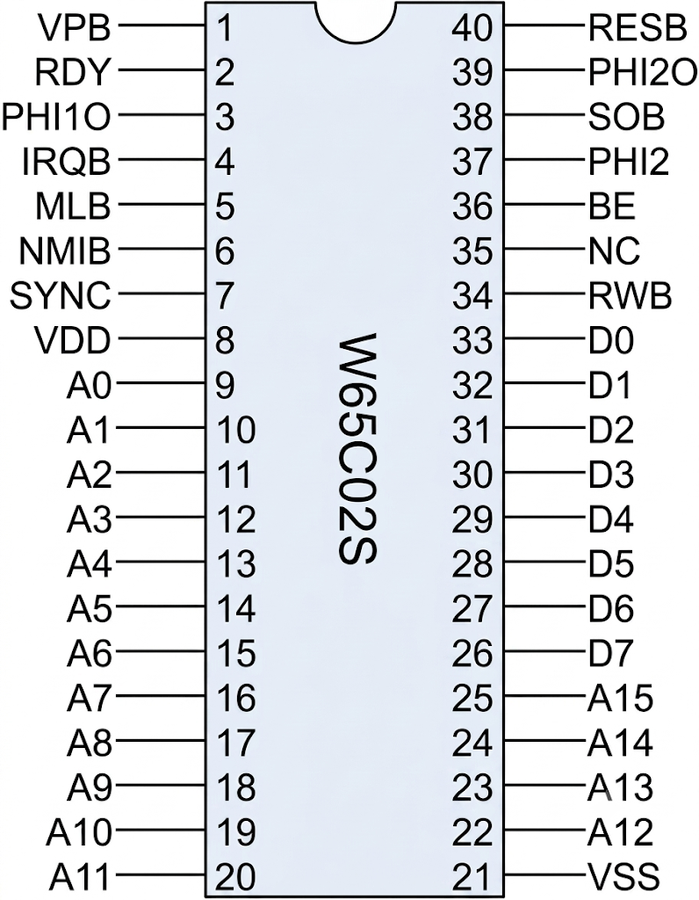
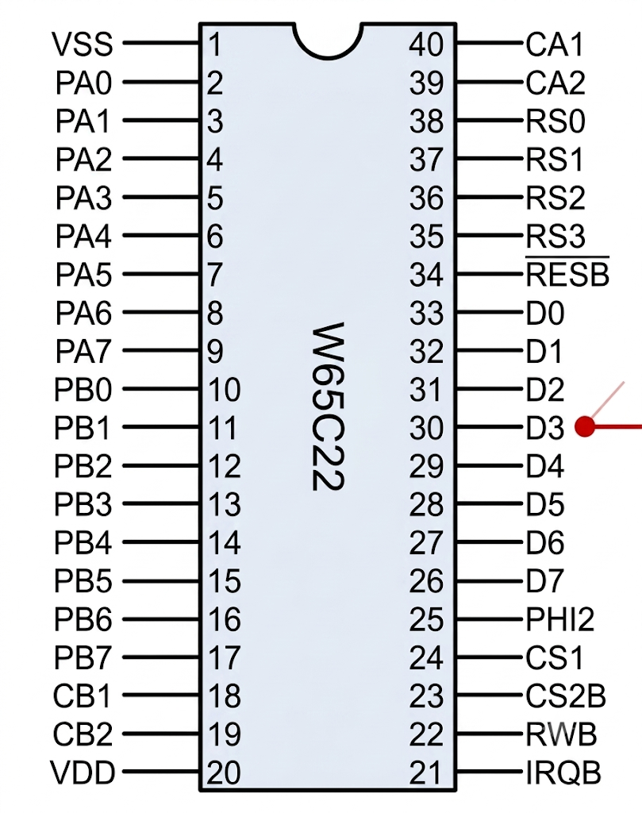
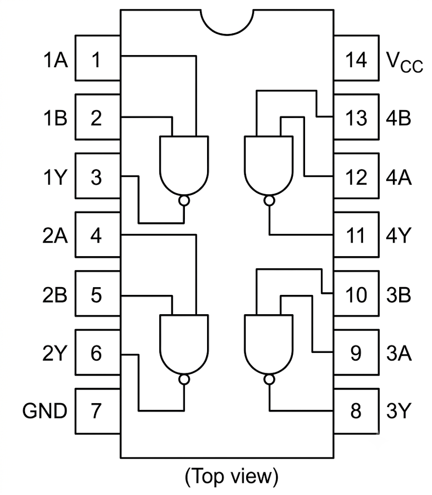

# W65C02 8-bitarsdator med Arduino Mega-emulering

En hembyggd 8-bitarsdator med **W65C02S** CPU och **Arduino Mega 2560** som minnesemulator och klockgenerator. Projektet byggs stegvis — från en blinkande LED till en fullt fungerande dator med I/O-expansion (W65C22 VIA) och LCD-display styrd direkt av 6502-processorn.

---

## Webbplatsen (Material for MkDocs)

Sajten (6502.smutje.se) byggs från markdown-filerna i `docs/` med **Material for MkDocs**. `docs/` är källan — du redigerar bara markdown, aldrig `site/`.

### Bygga

```bash
cd /var/www/6502.smutje.se
.venv/bin/mkdocs build      # bygger site/ — Apache servear site/ direkt
.venv/bin/mkdocs serve      # lokal förhandsvisning på http://localhost:8000
```

### Arbetsflöde

1. Redigera `docs/*.md` (text, tabeller, bildreferenser)
2. Kör `mkdocs build`
3. Sajten är omedelbart uppdaterad — inget mer behövs

### Regler att hålla

- **Blankrader kring tabeller** — en tabell måste ha tomrad före och efter. Utan tomrad efter tabellen slukar tabellen nästa rubrik som tabellrad.
- **Kodrutorna är live** — kod visas via snippets (`--8<--`) direkt från `Mega_2560_6502/src/*.inc`, `asm/*.asm` och `scripts/*.py`. Ändra källfilen → nästa bygge visar nya koden, utan att röra md.
- **`site/` rörs aldrig** — genereras vid varje bygge och skrivs över.
- **`legacy/`** — arkiv av den gamla handskrivna HTML-sajten (stepX.html, style.css).
- Nya sidor läggs till i `nav:` i `mkdocs.yml`.

### Installation på ny maskin

```bash
python3 -m venv .venv
.venv/bin/pip install mkdocs-material mdx-truly-sane-lists
```

---

## Komponenter (alla steg)

| Antal | Komponent |
|-------|-----------|
| 1 | W65C02S (DIP-40) |
| 1 | Arduino Mega 2560 |
| 1 | W65C22 VIA (DIP-40) — steg 7 |
| 1 | 74HC00 (quad NAND) — steg 7 |
| 1 | 74HC00 (quad NAND) — steg 10 (EEPROM-avkodning) |
| 1 | 62256 SRAM (DIP-28, 32 KB) — steg 9 |
| 1 | AT28C256 EEPROM (DIP-28, 32 KB) — steg 10 |
| 1 | Arduino Mega 2560 (till) — EEPROM-programmerare, steg 10 |
| 1 | LCD 16×2 eller 20×4 (parallell, t.ex. QC1602A) — steg 5 |
| 1 | Lysdiod (klockindikering) |
| 1 | 220 Ω motstånd (LED-strömbegränsning) |
| 1 | 220 Ω motstånd (LCD-bakgrundsbelysning) |
| 1 | 10 kΩ potentiometer (LCD-kontrast) |
| 4 | 10 kΩ motstånd (pull-up: RDY, IRQB, NMIB, SOB) |
| 1 | 10 kΩ motstånd (pull-up: BE → +5V) |
| 8 | 100 Ω motstånd (databuss-skydd) |
| 1 | 100 nF keramisk kondensator (avkoppling CPU) |
| 1 | 10 µF elektrolytisk kondensator (strömstabilisering) |
| 2 | Tryckknappar (klocksteg, instruktionssteg) |
| 1 | 16 MHz-oscillator (DIL-14) — steg 12 |
| 1 | 74HC393 (dubbel 4-bitars ripple-räknare) — steg 12 |
| 1 | Tryckknapp (till) — reset, steg 12 |
| 1 | 10 kΩ motstånd (till) — reset pull-up, steg 12 |
| 1 | 10 µF elektrolytisk kondensator (till) — reset-RC, steg 12 |
| — | Kopplingsdäck + kopplingstråd |

---

## W65C02S — pinout  



| Pin | Namn | I/O | Beskrivning |
|-----|------|-----|-------------|
| 1 | VPB | Ut | Vector Pull — utgång, ansluts ej |
| 2 | RDY | In | Ready — HÖG = CPU kör, LÅG = paus |
| 3 | PHI1O | Ut | Phase 1 Out — klocka ut, ansluts ej |
| 4 | IRQB | In | Interrupt Request (aktiv LÅG) |
| 5 | MLB | Ut | Memory Lock — utgång, ansluts ej |
| 6 | NMIB | In | Non-Maskable Interrupt (aktiv LÅG) |
| 7 | SYNC | Ut | Opcode fetch — HÖG vid instruktionshämtning |
| 8 | VDD | — | Strömmatning +5V |
| 9 | A0 | Ut | Adressbuss bit 0 |
| 10 | A1 | Ut | Adressbuss bit 1 |
| 11 | A2 | Ut | Adressbuss bit 2 |
| 12 | A3 | Ut | Adressbuss bit 3 |
| 13 | A4 | Ut | Adressbuss bit 4 |
| 14 | A5 | Ut | Adressbuss bit 5 |
| 15 | A6 | Ut | Adressbuss bit 6 |
| 16 | A7 | Ut | Adressbuss bit 7 |
| 17 | A8 | Ut | Adressbuss bit 8 |
| 18 | A9 | Ut | Adressbuss bit 9 |
| 19 | A10 | Ut | Adressbuss bit 10 |
| 20 | A11 | Ut | Adressbuss bit 11 |
| 21 | VSS | — | Systemjord GND |
| 22 | A12 | Ut | Adressbuss bit 12 |
| 23 | A13 | Ut | Adressbuss bit 13 |
| 24 | A14 | Ut | Adressbuss bit 14 |
| 25 | A15 | Ut | Adressbuss bit 15 |
| 26 | D7 | I/O | Databuss bit 7 (MSB) |
| 27 | D6 | I/O | Databuss bit 6 |
| 28 | D5 | I/O | Databuss bit 5 |
| 29 | D4 | I/O | Databuss bit 4 |
| 30 | D3 | I/O | Databuss bit 3 |
| 31 | D2 | I/O | Databuss bit 2 |
| 32 | D1 | I/O | Databuss bit 1 |
| 33 | D0 | I/O | Databuss bit 0 (LSB) |
| 34 | RWB | Ut | Read/Write — HÖG = läs, LÅG = skriv |
| 35 | NC | — | Ej ansluten |
| 36 | BE | In | Bus Enable — HÖG = bussar aktiva, LÅG = tri-state |
| 37 | PHI2 | In | Phase 2 In — klockingång |
| 38 | SOB | In | Set Overflow (aktiv LÅG) |
| 39 | PHI2O | Ut | Phase 2 Out — klocka ut, ansluts ej |
| 40 | RESB | In | Reset (aktiv LÅG) |

---

## W65C22 VIA — pinout



## 74HC00 — pinout



---

## CPU-kopplingar (gäller alla steg)

| CPU-pin | Signal | Arduino | Not |
|---------|--------|---------|-----|
| 8 | VDD | 5V | Strömmatning |
| 21 | VSS | GND | Systemjord |
| 37 | PHI2 | D2 | Klocka (500 Hz) |
| 34 | R/W | D3 | Read/Write |
| 40 | /RESET | D4 | Reset |
| 2 | RDY | 5V via 10kΩ | Pull-up |
| 4 | /IRQ | 5V via 10kΩ | Pull-up |
| 6 | /NMI | 5V via 10kΩ | Pull-up |
| 36 | BE | +5V via 10kΩ | Bus Enable — HÖG = bussar aktiva |
| 38 | /SO | 5V via 10kΩ | Pull-up |

### Adressbuss (1:1)
| CPU | Arduino | Register |
|-----|---------|----------|
| A0–A7 (pin 9–16) | A0–A7 | `PORTF` |
| A8–A15 (pin 17–20,22–25) | A8–A15 | `PORTK` |

### Databuss
| CPU | Arduino | Register |
|-----|---------|----------|
| D0–D7 (pin 26–33) | D22–D29 | `PORTA` |

### Knappar & SYNC
| Signal | Arduino |
|--------|---------|
| SYNC (CPU pin 7) | D13 |
| BTN1 (klocksteg) | D11 → GND |
| BTN2 (instr.steg) | D12 → GND |

---

## Adressrymd

```
$FFFF ┌──────────────┐
      │  EEPROM ROM   │  $C000–$FFFF (steg 11: program + vektorer)
$C000 ├──────────────┤
$BFFF │  W65C22 VIA   │  $8000–$BFFF (I/O-fönster, 16 KB)
$8000 ├──────────────┤
      │              │
$7FFF ├──────────────┤
      │  62256 SRAM   │  $0000–$7FFF (steg 11: 32 KB, hela chippet)
$0000 └──────────────┘
```

Steg 7–10 använde VIA på $4000 (register speglas i $4000–$7FFF). Steg 9–10 använde SRAM på $0000–$3FFF; steg 7–8 hade Arduino-emulerat RAM (1 KB). Från och med steg 11: SRAM täcker hela 32 KB, VIA sitter i ett I/O-fönster på $8000 och EEPROM på $C000.

---

## Stegöversikt

| Steg | Innehåll | Ny hårdvara |
|------|----------|-------------|
| 1 | CPU + ström + klocka + LED | CPU, LED, 100nF, 10µF |
| 2 | Adressbuss + reset | 16 kopplingstrådar |
| 3 | Databuss + minnesemulering | 8×100Ω |
| 4 | Knappar + stegning | 2 knappar |
| 5 | LCD via Arduino (parallell 4-bit) | LCD, 10kΩ pot, 220Ω |
| 6 | Eget 6502-program (räknare) | — (samma hårdvara) |
| 7 | W65C22 VIA + 74HC00, LCD via VIA | VIA, 74HC00 |
| 8 | Assembler-bygge med ca65 | — (samma hårdvara) |
| 9 | Riktigt RAM (62256 SRAM) | 62256 SRAM |
| 10 | EEPROM som ROM (AT28C256) | AT28C256 EEPROM, 2:a 74HC00, 2:a Arduino (programmerare) |
| 11 | Städad adressrymd | — (omkoppling, ingen ny krets) |
| 12 | Fristående klocka | 16 MHz-oscillator, 74HC393 |

---

## Steg 5–6: LCD-koppling (parallell 4-bit, Arduino direkt)

| LCD-pin | Arduino | Funktion |
|---------|---------|----------|
| VSS (1) | GND | Jord |
| VDD (2) | 5V | Ström |
| VO (3) | Potentiometer | Kontrast |
| RS (4) | D5 | Register Select |
| R/W (5) | GND | Write-only |
| E (6) | D6 | Enable |
| DB4 (11) | D10 | Data (omvänd ordning) |
| DB5 (12) | D9 | |
| DB6 (13) | D8 | |
| DB7 (14) | D7 | |
| A (15) | 5V via 220Ω | Bakgrundsbelysning |
| K (16) | GND | |

## PlatformIO — växla mellan steg

Steg 1–11 finns som separata `.inc`-filer i `src/`. `main.cpp` är en dispatcher som inkluderar rätt fil baserat på `-DSTEPx`. Steg 12 är helt fristående — ingen Arduino-kod, programmet bränns i EEPROM:en.

### I VS Code
Välj aktiv miljö i PlatformIO-fliken: `env:step1` … `env:step11`, klicka sedan Upload.

### Kommandorad
```bash
pio run -e step11 -t upload -t monitor  # steg 11 (städad adressrymd)
pio run -e step10 -t upload -t monitor  # steg 10 (EEPROM som ROM)
pio run -e step8 -t upload -t monitor   # steg 8 (assembler-bygge)
pio run -e step7 -t upload -t monitor   # steg 7 (VIA + LCD)
pio run -e step6 -t upload -t monitor   # steg 6 (räknarprogram)
pio run -t upload -t monitor            # default = steg 9
```

### Filstruktur
```
src/
├── main.cpp        # dispatcher (#ifdef)
├── step1.inc       # klocka + lysdiod
├── step2.inc       # adressbuss + reset
├── step3.inc       # databuss + NOP
├── step4.inc       # knappar
├── step5.inc       # LCD via Arduino
├── step6.inc       # räknarprogram
├── step7.inc       # VIA + LCD
├── step8.inc       # Assembler-bygge (ca65)
├── step9.inc       # 62256 SRAM
├── step10.inc      # EEPROM som ROM
├── step11.inc      # städad adressrymd
├── program_hello.h # genereras av build_asm.py (ca65 → ld65 → bin2h)
└── program_fib.h   # genereras av build_asm.py

asm/
├── program.cfg     # ld65-länkskript
├── program_hello.asm
└── program_fib.asm

scripts/
├── build_asm.py    # pre-build-hook: ca65 + ld65 + bin2h för alla *.asm
├── bin2h.py        # .bin → C-header
└── upload_eeprom.py # skicka .bin till EEPROM-programmeraren (steg 10)

EEPROM_programmer/
└── EEPROM_programmer.ino  # separat Arduino (steg 10, Arduino IDE)
```

## Steg 7: LCD via VIA (8-bit parallell)

CPU:n ($8000-programmet) styr LCD:n genom att skriva till VIA:ns register ($4000–$4003).
Arduinon är endast minnesemulator + klocka — all LCD-logik körs på 6502.

### VIA → LCD

| VIA-pin | Signal | LCD-pin | Funktion |
|---------|--------|---------|----------|
| 2 | PA0 | 4 (RS) | Register Select |
| 4 | PA2 | 6 (E) | Enable |
| 10–17 | PB0–PB7 | 7–14 (DB0–DB7) | 8-bitars data |

### 74HC00 adressavkodning → VIA $4000–$400F

| 74HC00 | Ansluts till | Funktion |
|--------|-------------|----------|
| 1, 2 (U4A in) | CPU A15 | Inverterare (NOT A15) |
| 3 (U4A ut) | U4B pin 4 | NOT A15 → NAND-ingång |
| 5 (U4B in) | CPU A14 | (NOT A15) NAND A14 |
| 6 (U4B ut) | VIA pin 23 (CS2B) | LÅG vid $4000–$7FFF → VIA aktiv |
| 14 (VCC) | +5V | Strömmatning |
| 7 (GND) | GND | Systemjord |

### 6502-programflöde (steg 7)

1. **Sätt VIA-portar:** `LDA #$FF` → `STA $4002` (DDRB) → `STA $4003` (DDRA)
2. **LCD-init (8-bit):** $30 × 3 → $38 (function set) → $0C (display ON) → $01 (clear) → $06 (entry mode)
3. **Skriv text:** Flytta cursor via kommando ($80, $C0 för rad 1–2), skriv tecken via PORTB + pulsa E på PORTA
4. **Clear + loop:** $01 (clear display) → JMP tillbaka till start

### Felsökning steg 7

| Symptom | Trolig orsak |
|---------|-------------|
| CPU startar ej (RWB=L, adress=0) | BE ej kopplad till +5V, eller RESB når ej CPU |
| CPU läser $FFFC/$FFFD men hoppar till $0000 | Databuss-timing: `DDRA=0x00` måste ske EFTER `PHI2=LOW` |
| VIA-skrivningar i logg men LCD visar inget | Kontrollera VIA→LCD-kablar, särskilt DB0–DB7 (8 st) |
| E/RS växlar men LCD blank | Vrid kontrast-potentiometer, kolla bakgrundsbelysning (A/K) |
| Text skrivs om på flera rader | JMP pekar tillbaka till hello-start istället för halt-loop |

---

## Varningar

- **100Ω seriemotstånd på databussen är obligatoriska** — utan dem kan en busskollision förstöra CPU och Arduino.
- **BE (pin 36) måste vara HÖG (+5V)** — LÅG tri-statar bussarna.
- **Använd 12–18V DC-adapter** till Arduino för stabil 5V-matning.
- **Kopplingsbrädor kan ha dolda kortslutningar** — flytta kretsen vid misstänkt fel.
