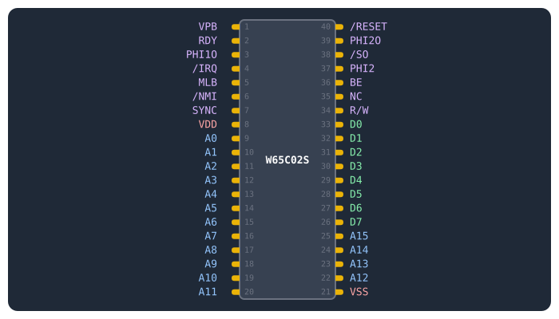
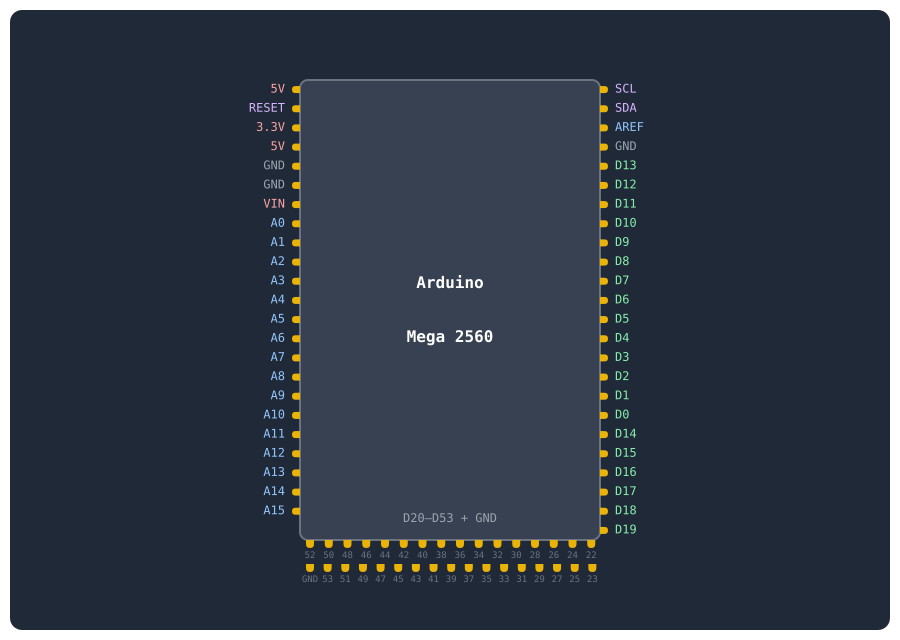
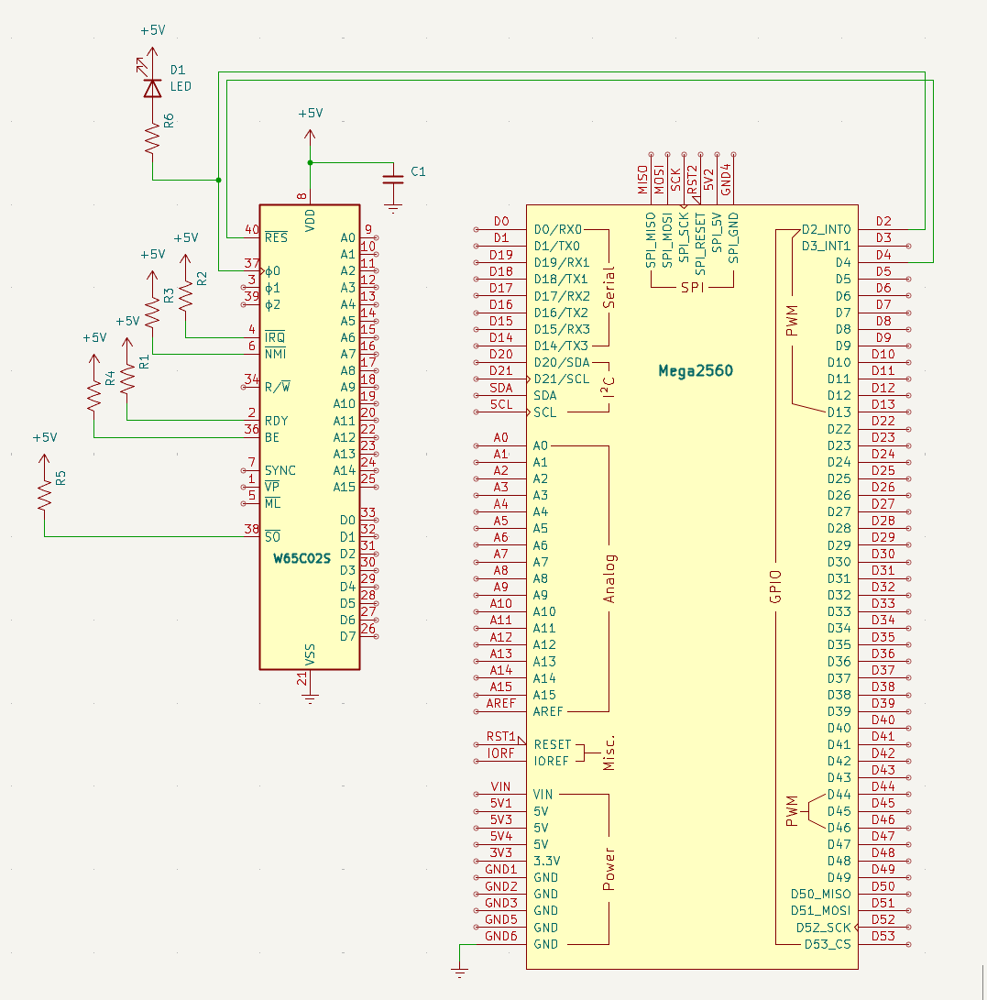

# Strömmatning och klocka

Det är något speciellt i att hålla en processor i handen och veta att den snart ska vakna.

## Mål

Alla datorer behöver en puls. ETt hjärtslag som får processorn att ta ett steg i taget. I det här första steget kopplar jag in ström och klocka till **W65C02S**-processorn, eller CPU. CPU:n kommer inte att *göra* något ännu (jag har varken minne eller program), men jag kan verifiera att den lever.

**W65C02S** är en *statisk CMOS-krets*. Det betyder att klockan kan vara hur långsam som helst — till och med stoppas helt — utan att CPU:n tappar sitt interna tillstånd. 

En lysdiod kopplas till klocklinjen. När dioden blinkar vet jag att klockpulsen når fram. Med en multimeter mäter jag också att CPU:n får `5V` mellan `VDD` och `VSS`.

## Komponenter för detta steg

Här är allt som krävs för att väcka CPU:n till liv.

??? note "📦 Komponenter — CPU, klocka och ström"

    | Antal | Komponent | Namn |
    |---|---|---|
    | 1 | W65C02S (DIP-40) | CPU |
    | 1 | Arduino Mega 2560 | Kontrollenhet |
    | 1 | Lysdiod (röd) | D1 |
    | 1 | 220 Ω motstånd (klock-LED) | R6 |
    | 5 | 10 kΩ motstånd (pull-up: RDY, IRQB, NMIB, SOB) | R1, R2, R3, R4, R5 |
    | 1 | 100 nF keramisk kondensator (avkoppling CPU) | C1 |

## W65C02S pinout

Här är alla pinnar på **W65C02S**-processorn. 



## Arduino Mega 2560 pinout

Här är alla pinnar på **Arduino Mega 2560**.



## Kopplingsschema

Så här ser det kompletta kopplingsschemat ut när allt ligger på kopplingsdäcket: CPU:n till vänster, Arduino till höger, lysdiod och pull-up-motstånd på sina platser. 



## Kopplingar

Här är varenda koppling i steg 1, pinne för pinne. Avkopplingskondensatorn är markerad separat längst ner.

??? note "📦 Kopplingar — CPU, klocka och ström"

    | Pin | Signal | Kopplas till | Varför |
    |---|---|---|---|
    | 8 | `VDD` | +5V | Strömmatning — CPU:ns driftspänning |
    | 21 | `VSS` | GND | Systemjord — sluten krets |
    | 37 | `PHI2` | Arduino D2 | Klockingång — Arduino skickar fyrkantsvåg |
    | 2 | `RDY` | +5V via 10kΩ | Ready — HÖG = CPU får köra. Utan denna stannar CPU:n |
    | 4 | `/IRQ` | +5V via 10kΩ | Interrupt request — HÖG = inget avbrott (jag använder ej avbrott än) |
    | 6 | `/NMI` | +5V via 10kΩ | Non-maskable interrupt — måste vara HÖG, annars kraschar CPU:n |
    | 36 | `BE` | +5V via 10kΩ | Bus Enable — HÖG = bussarna aktiva. Utan denna är CPU:n bortkopplad! |
    | 38 | `/SO` | +5V via 10kΩ | Set Overflow — HÖG = avaktiverad |
    | 40 | `/RESET` | Arduino D4 | Hålls låg av Arduino — CPU:n ligger i reset |
    | — | 100nF | Mellan VDD (pin 8) och VSS (pin 21) | Avkopplingskondensator — filtrerar bort brus på strömmatningen. Sätt den så nära CPU:n som möjligt! |

## Arduino-kod

Nu ska jag skriva koden som väcker processorn till liv. Det här är första gången jag laddar upp något till **Arduinon** — och det är ett perfekt tillfälle att förstå hur ett **Arduino**-program är uppbyggt.

### Så fungerar ett Arduino-program

Varje **Arduino**-program består av två funktioner som plattformen anropar automatiskt:

- `setup()` — körs *en enda gång* när **Arduinon** startar (eller efter reset). Här konfigurerar jag pinnar, startar seriekommunikation och initierar allt som behöver vara klart innan programmet börjar loopa.
- `loop()` — körs *om och om igen i all oändlighet*. Varje varv i loopen är en chans att läsa sensorer, uppdatera utgångar eller — som i mitt fall — generera en klockpuls.

### Kodens arkitektur i detta steg

Koden är uppdelad i tre lager:

1. **Definitioner och konstanter** — längst upp definierar jag pinnar (`PHI2`, `RESB`) och räknar ut klockfrekvensen. Genom att använda namngivna konstanter istället för magiska siffror blir koden läsbar och lätt att ändra — vill jag testa en snabbare klocka ändrar jag bara `CLOCK_HZ`.
2. **Hjälpfunktionen** `pulse()` som genererar en komplett klockcykel. Funktionen drar `PHI2` HÖG i 500 ms (lysdioden lyser), sedan LÅG i 500 ms (lysdioden släcks). Resultatet är en symmetrisk fyrkantsvåg på 1 Hz — tillräckligt långsamt för att jag ska kunna följa med i vad som händer. 
3. **Funktionerna** `setup()` och `loop()` — i `setup()` konfigurerar jag pinnar, håller CPU:n i reset och startar seriekommunikation. I `loop()` anropar jag bara `pulse()`.

### Vad jag ser när koden kör

När jag laddat upp koden och öppnar seriemonitorn ser jag texten "Steg 1 — Klocka och ström". Lysdioden på klocklinjen blinkar en gång per sekund — den är tänd när `PHI2` är hög (CPU:n arbetar) och släckt när `PHI2` är låg. Jag har just gett processorn dess första hjärtslag.

??? note "📦 Arduino-kod"

    ```cpp
    --8<-- "Mega_2560_6502/src/step1.inc"
    ```

## Exempel på körning

När jag öppnar seriemonitorn i **VS Code** eller **PlatformIO** ser jag:

```text title="Terminal"
Steg 1 — Klocka och ström
Lysdioden på PHI2 ska blinka 1 Hz
```

Jag provar att ändra `CLOCK_HZ` från `1` till `10` och laddar upp igen. Dioden blinkar nu tio gånger per sekund — för snabbt för att urskilja enskilda pulser, men jag ser att den lyser svagare eftersom den är släckt halva tiden. Det här är samma princip som senare steg använder när klockan körs i 500 Hz — då syns inte blinkandet alls, men processorn jobbar för fullt.

## Så här felsöker man

Här är några saker att kontrollera om koden inte beter sig som förväntat:

- Dioden blinkar inte? Då kontrollerar jag att jag har rätt pinne (`D2`), att dioden är rättvänd (långa benet till `D2` via motstånd, korta till `GND`), och att motståndet är 220Ω.
- Dioden lyser konstant? Då har jag förmodligen glömt `delay()` eller har en kortslutning.
- Spänningen under 4.8V? Då använder jag en 12V DC-adapter i Arduinons barrel-jack. USB-portar ger ofta för låg spänning.
- Jag glömmer inte avkopplingskondensatorn! 100nF keramisk mellan `VDD` och `VSS`, så nära CPU:n som möjligt. Utan den kan CPU:n bete sig oberäkneligt.

