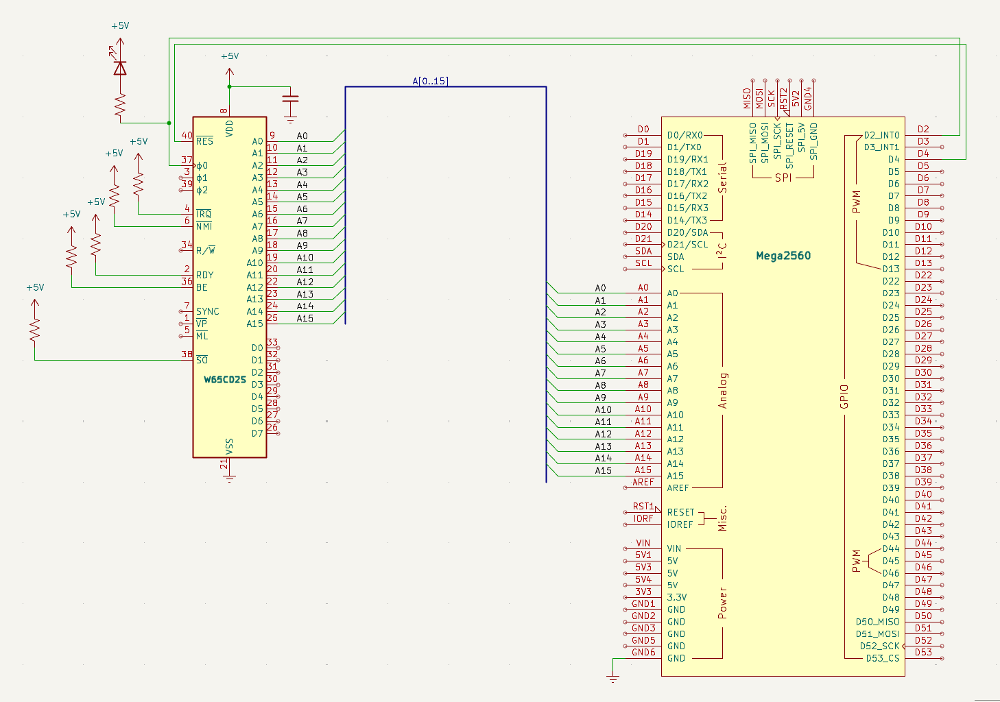

# Adressbuss och reset

Första gången jag såg en 6502 leta upp sin egen startadress i seriemonitorn var ögonblicket då allt föll på plats. Den här processorn vet exakt var den ska börja — jag ska bara få se det hända.

## Mål

I steg 1 gav jag processorn ström och klocka. Nu ska jag ge den kontroll över adressbussen — 16 ledningar som talar om *var* i minnet CPU:n vill läsa eller skriva.

Alla 6502-processorer startar på samma sätt: efter reset läses den sk reset-vektorn på adress `$FFFC` och `$FFFD` för att få reda på var programmet börjar. Det är inbyggt i kisel — ingen mjukvara, ingen konfiguration. 

Jag kopplar också in `/RESET` (pin 40) till Arduino `D4`. När jag håller `RESB` låg i minst 2 klockcykler nollställs CPU:ns interna register. När jag sedan släpper den (HÖG) börjar CPU:n köra från reset-vektorn.

## Nya komponenter

Det här steget kräver inga nya elektroniska komponenter — bara kopplingstrådar. Sexton för adresslinjerna `A0–A15` och en extra för reset-signalen, eftersom jag nu tar kontroll över CPU:ns uppstart via `/RESET`.

| Antal | Komponent |
|---|---|
| 17 | Kopplingstrådar (16 adress + 1 RESB) |

## Kopplingsschema

Schemat visar den nya kopplingen: 16 adresslinjer som löper från CPU:ns `A0–A15` till Arduinons analoga portar `A0–A15`, plus reset-signalen från `D4` till `/RESET`. Allt annat är oförändrat från steg 1.



## Kopplingar

Här är varenda koppling i steg 2, pinne för pinne. 

??? note "📦 Kopplingar — CPU, klocka, ström, adressbuss och reset"

    | Pin | Signal | Kopplas till | Varför |
    |---|---|---|---|
    | 8 | `VDD` | +5V | Strömmatning — CPU:ns driftspänning |
    | 21 | `VSS` | GND | Systemjord — sluten krets |
    | 37 | `PHI2` | Arduino D2 | Klockingång — Arduino skickar fyrkantsvåg |
    | 2 | `RDY` | +5V via 10kΩ | Ready — HÖG = CPU får köra. Utan denna stannar CPU:n |
    | 4 | `/IRQ` | +5V via 10kΩ | Interrupt request — HÖG = inget avbrott |
    | 6 | `/NMI` | +5V via 10kΩ | Non-maskable interrupt — måste vara HÖG |
    | 36 | `BE` | +5V via 10kΩ | Bus Enable — HÖG = bussarna aktiva. Utan denna är CPU:n bortkopplad! |
    | 38 | `/SO` | +5V via 10kΩ | Set Overflow — avaktiverad |
    | 40 | `/RESET` | Arduino D4 | Kontrollerad reset — Arduino håller CPU:n i reset tills jag är redo |
    | 9–16 | `A0–A7` | Arduino A0–A7 | Låga adressbyte — läses via PORTF |
    | 17–20, 22–25 | `A8–A15` | Arduino A8–A15 | Höga adressbyte — läses via PORTK |

## Arduino-kod

I steg 1 gav jag processorn liv. Nu ska jag lyssna på vad den säger. Koden i detta steg gör något fundamentalt: den *läser av processorns adressbuss* — 16 ledningar som tillsammans talar om var i minnet CPU:n vill läsa — och skriver ut adressen i seriemonitor. Det är som att koppla in en logikanalysator, fast gratis.

### Portregister — att läsa 8 pinnar på en gång

**Arduino Mega 2560** har 54 digitala pinnar, men att läsa dem en och en med `digitalRead()` är alldeles för långsamt. Varje anrop tar flera mikrosekunder — och med 16 adresslinjer skulle jag tappa synkroniseringen med processorn direkt. Lösningen är *portregister* — specialregister som läser eller skriver 8 pinnar samtidigt i en enda maskininstruktion:

- `DDRF = 0x00` — sätt alla 8 pinnar på `PORTF` som ingångar. Motsvarar 8 × `pinMode()` men går på några nanosekunder.
- `PINF` — läs alla 8 pinnar på en gång. Varje bit i byten motsvarar en pinne. Här är det CPU:ns `A0–A7`.
- `PINK` — läser CPU:ns `A8–A15` på samma sätt.

För att få ihop en 16-bitars adress skiftar jag ihop de två byten:

```
uint16_t addr = (PINF << 0) | (PINK << 8);
```

Resultatet är ett tal mellan 0 och 65 535 — processorns fullständiga adressrymd.

### Reset-sekvensen — vad som händer när CPU:n vaknar

Koden gör tre saker i `setup()`:

1. Håller CPU:n i reset — `RESB = LOW` i minst 2 klockcykler (jag kör 5 för säkerhets skull). Under denna tid är CPU:ns interna register nollställda och bussarna är tri-state.
1. Släpper reset — `RESB = HIGH`. Detta är ögonblicket CPU:n vaknar. Den gör inget val, fattar inget beslut — den läser helt enkelt reset-vektorn på adress `$FFFC` och `$FFFD`.
1. Läser och loggar — i `loop()` läser jag adressbussen i varje klockcykel och skriver ut den. Första två raderna kommer alltid att vara `$FFFC` och `$FFFD` — reset-vektorn. Det är processorns sätt att fråga "var ska jag börja?".
### Vad som är nytt jämfört med steg 1

Klockan har höjts från 1 Hz till 500 Hz — för snabbt för att se med ögat, men lagom för att läsa adressbussen i seriemonitor. `pulse()` har förenklats (ingen lysdiod denna gång) och `loop()` gör nu det tunga jobbet: läsa portregister, skifta ihop adressen, skriva ut. `setup()` har fått en reset-sekvens — den viktigaste nyheten i detta steg.

??? note "📦 Arduino-kod"

    ```cpp
    --8<-- "Mega_2560_6502/src/step1.inc"
    ```

## Exempel på körning

När jag öppnar seriemonitor efter uppladdning ser jag ungefär detta:

<div class="xmon-wrap">

```text title="Seriemonitor"
Steg 2 — adressbuss och reset
R $FFFC
R $FFFD
R $8000
R $8001
R $8002
R $8003
Klar — nu loopar vi:
R $8004
R $8005
R $8006
...
```

</div>

Varje rad börjar med `R` (Read — CPU:n läser) följt av `$` och en hexadecimal adress. De två första raderna är alltid `$FFFC` och `$FFFD` — reset-vektorn. Processorn frågar "var ska jag börja?" och svaret (som just nu är skräp eftersom databussen inte är inkopplad) leder den till någon adress — ofta `$8000` eller `$0000` beroende på vad som ligger på de flytande datalinjerna.

Lägg märke till att `$FFFC` och `$FFFD` bara dyker upp en gång — efter reset. Sedan räknar adresserna uppåt när CPU:n hämtar instruktioner. Utan databuss (steg 3) kan CPU:n inte hämta riktiga opcodes, men adressbussen fungerar redan — och det är precis vad jag ville bevisa.

## Så här felsöker man

Här är några saker jag kontrollerar:

- Ser jag bara `0` eller `1`? Då är CPU:n fortfarande i reset eller `BE` är LÅG. Jag kontrollerar att `RESB` går HÖG efter reset-sekvensen, och att `BE` har +`5V`.
- Ser jag `FFFC` men inte `FFFD`? Då är någon adresslinje felkopplad. Jag dubbelkollar `A0–A15` en och en.
- Skräptecken i seriemonitor? Då måste baud rate vara 115200. Jag kontrollerar `platformio.ini` om jag använder PlatformIO. 
