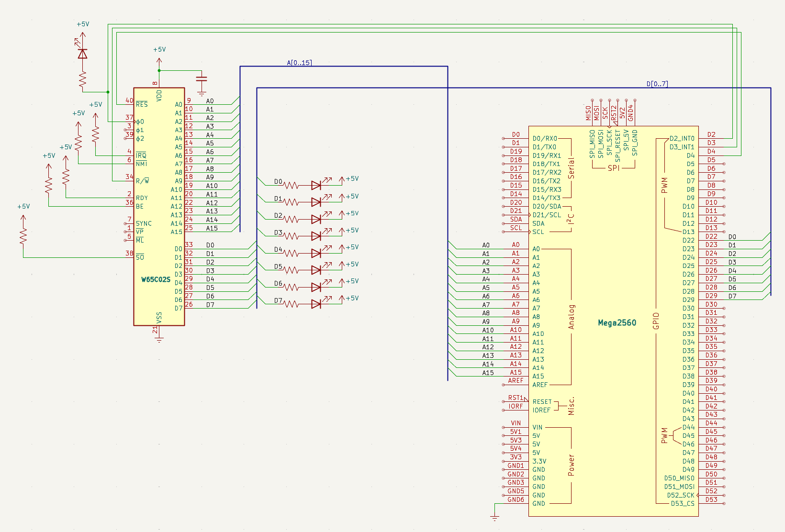

# Databuss och minne

Utan databuss är processorn blind — den pekar på saker den aldrig får se. Det här steget är datorns födelse: nu svarar någon på frågorna.

## Mål

Hittills har CPU:n kunnat tala om *var* den vill läsa mha adressbussen. Nu kopplar jag in databussen — 8 ledningar som bär den faktiska informationen mellan CPU:n och minnet. Utan databuss kan CPU:n inte hämta instruktioner och är helt blind.

Jag kopplar också in `R/W`-signalen (pin 34). Den talar om ifall CPU:n vill läsa (HÖG) eller skriva (LÅG). Arduinon använder denna för att veta om den ska skicka data till CPU:n eller ta emot.

Arduinon blir nu en *minnesemulator*: en array `ram[1024]` lagrar data, och i varje klockcykel kollar Arduinon adressen och `R/W` — om CPU:n läser, lägger den ut rätt byte på databussen via `PORTA`. Om CPU:n skriver, läser Arduinon av vad som skrevs.

Jag laddar ett minimalt 6502-program på `$8000`: en enda `NOP`-instruktion (`$EA`) som gör ingenting och går vidare till nästa adress — vilket också är `NOP`. Resultat: CPU:n loopar för evigt, och jag kan följa varje steg i seriemonitor.

## Nya komponenter

Databussen är den första känsliga kretskopplingen i projektet: åtta 100Ω-motstånd som skyddar mot busskollisioner mellan CPU och Arduino, plus en kopplingstråd för `R/W`-signalen som talar om vem som skickar data åt vilket håll.

| Antal | Komponent |
|---|---|
| 8 | 100 Ω motstånd (databuss-skydd) |
| 1 | Kopplingstråd (R/W) |

## Kopplingsschema

Nu är datorn komplett i grunden: adressbuss från steg 2, databuss `D0–D7` via 100Ω-skydd till Arduino `D22–D29`, och `R/W`-signalen från CPU pin 34 till Arduino `D3`. 



## Kopplingar

Alla kopplingar från steg 2 finns kvar; tabellen lägger till databussens åtta ledningar `D0–D7` och `R/W`-signalen.

| Pin | Signal | Kopplas till | Varför |
|---|---|---|---|
| 8 | `VDD` | +5V | Strömmatning — CPU:ns driftspänning |
| 21 | `VSS` | GND | Systemjord — sluten krets |
| 37 | `PHI2` | Arduino D2 | Klockingång — Arduino skickar fyrkantsvåg |
| 2 | `RDY` | +5V via 10kΩ | Ready — HÖG = CPU får köra. Utan denna stannar CPU:n |
| 4 | `/IRQ` | +5V via 10kΩ | Interrupt request — HÖG = inget avbrott |
| 6 | `/NMI` | +5V via 10kΩ | Non-maskable interrupt — måste vara HÖG |
| 36 | `BE` | +5V via 10kΩ | Bus Enable — HÖG = bussarna aktiva. Utan denna är CPU:n bortkopplad! |
| 38 | `/SO` | +5V via 10kΩ | Set Overflow — avaktiverad |
| 40 | `/RESET` | Arduino D4 | Kontrollerad reset — Arduino håller CPU:n i reset tills jag är redo |
| 9–16 | `A0–A7` | Arduino A0–A7 | Låga adressbyte — läses via PORTF |
| 17–20, 22–25 | `A8–A15` | Arduino A8–A15 | Höga adressbyte — läses via PORTK |
| 34 | `R/W` | Arduino D3 | HÖG = CPU läser, LÅG = CPU skriver. Arduino måste veta detta |
| 33 | `D0` | Arduino D22 via 100Ω | Databit 0 (LSB) |
| 32 | `D1` | Arduino D23 via 100Ω | Databit 1 |
| 31 | `D2` | Arduino D24 via 100Ω | Databit 2 |
| 30 | `D3` | Arduino D25 via 100Ω | Databit 3 |
| 29 | `D4` | Arduino D26 via 100Ω | Databit 4 |
| 28 | `D5` | Arduino D27 via 100Ω | Databit 5 |
| 27 | `D6` | Arduino D28 via 100Ω | Databit 6 |
| 26 | `D7` | Arduino D29 via 100Ω | Databit 7 (MSB) |

## Arduino-kod

Det här är det största kodsteget hittills och det viktigaste. Arduino går från att vara en passiv observatör till att bli en *fullvärdig minnesemulator*. CPU:n kommer att ställa frågor via adressbussen, och Arduino måste svara med rätt byte på databussen — allt inom loppet av en enda klockcykel. När det fungerar har jag en dator som faktiskt kör ett program.

### Databussen — 8 ledningar som bär information

Adressbussen talar om *var* CPU:n vill läsa. Databussen bär *vad* som ska läsas eller skrivas. Det är 8 ledningar — `D0` till `D7` — och de är *dubbelriktade*. Ibland driver CPU:n dem (vid skrivning), ibland Arduino (vid läsning). 

### `R/W`-signalen — vem som pratar

CPU:ns pin 34 (`R/W`) är trafikljuset på bussen. 

- När `R/W` är HÖG vill CPU:n läsa — Arduino ska då sätta `DDRA = 0xFF` (alla pinnar som utgångar) och lägga ut rätt byte på `PORTA`. 
- När `R/W` är LÅG vill CPU:n skriva — Arduino måste omedelbart sätta `DDRA = 0x00` (tri-state, hög impedans) så att CPU:n kan driva ledningarna utan motstånd. Det här skiftet sker i *varje klockcykel*, mitt i `pulse()`.

### Kodens fyra lager

1. `read_mem()` och `write_mem()` — två enkla funktioner som slår upp eller sparar en byte i rätt array. Vektorer hamnar i `vectors[6]`, arbetsminne i `ram[1024]`. Allt annat returnerar `$EA` (`NOP`) — en ofarlig fallback som gör att CPU:n bara hoppar vidare om den läser från en oanvänd adress. 
1. `pulse()` — datorns hjärta — samma struktur som tidigare men nu med ett avgörande tillägg: efter att ha läst adress och `R/W` bestämmer den om Arduino ska driva databussen (`DDRA = 0xFF`) eller gå ur vägen (`DDRA = 0x00`). Allt detta sker medan `PHI2` är låg. När `PHI2` sedan går hög läser CPU:n av databussen — eller skriver till den.
1. `setup()` — ladda programmet — här skrivs reset-vektorn (`$8000`) och en enda `NOP`-instruktion (`$EA`) in i minnet. Det är mitt första 6502-program: CPU:n startar på `$8000`, läser `$EA`, gör ingenting, går till `$8001`, läser `$EA` (minnet returnerar `NOP` överallt), och loopar för evigt.
1. `loop()` — anropar bara `pulse()`. En klockcykel per varv, med fullständig loggning i seriemonitor.

### Vad som är nytt jämfört med steg 2

Tre stora nyheter: 

- `R/W`-signalen kopplas in på `D3`, databussen på `D22–D29` via 100Ω, och minnesarrayerna `ram[]` och `vectors[]` gör att Arduino kan svara med olika data på olika adresser. 
- `pulse()` är nu en fullständig buss-emulator — det är den här funktionen som kommer att följa med oss genom resten av projektet.

??? note "📦 Arduino-kod"

    ```cpp
    --8<-- "Mega_2560_6502/src/step1.inc"
    ```

## Exempel på körning

När jag öppnar seriemonitor (115200 baud) ser jag CPU:n läsa reset-vektorn och sedan loopa på `NOP`:

``` title="Seriemonitor (115200 baud)"
Steg 3 — databuss och minnesemulering
R $FFFC
R $FFFD
R $8000
R $8001
R $8002
R $8003
R $8004
...
```

Alla rader börjar med `R` — CPU:n gör inget annat än att läsa, eftersom `NOP` varken skriver till minnet eller ändrar några register. Adresserna räknas uppåt: `$8000`, `$8001`, `$8002`… och eftersom minnet returnerar `$EA` (`NOP`) på alla adresser utanför programmet, kommer CPU:n att vandra genom hela adressrymden — upp till `$FFFF`, sedan börja om från `$0000` — i en oändlig loop.

Det ser kanske händelselöst ut, men varje rad i loggen är ett mirakel: Arduino har läst adressbussen, kollat `R/W`, slagit upp rätt byte i minnet, och lagt ut den på databussen — allt innan CPU:n hann märka någon fördröjning. Jag tittar på en fungerande dator vars program är att göra ingenting — och det är ögonblicket jag förstår att jag byggt en riktig dator.

## Så här felsöker man

Här är några saker jag kontrollerar:

- Ser jag `W $0` eller `W $1`? Då driver CPU:n inte bussarna. Jag kontrollerar `BE` (måste vara HÖG) och att `PHI2` når CPU:n.
- Ser jag `R $FFFC` men inget mer? Då är databussen felaktig. Jag kontrollerar `D22–D29` och att 100Ω-motstånden sitter på alla 8 ledningar.
- Hoppar CPU:n till konstig adress? Då är reset-vektorn fel. Jag dubbelkollar `write_mem(0xFFFC, 0x00)` och `write_mem(0xFFFD, 0x80)`.
- Jag glömmer inte 100Ω:en! Utan seriemotstånd kan en enda felaktig `DDRA`-inställning förstöra CPU:n eller Arduino.
