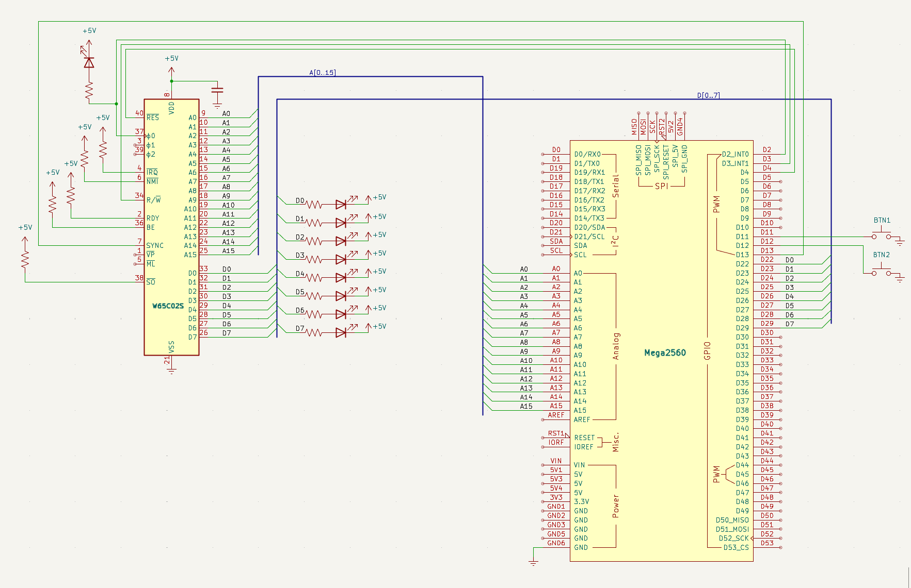

# Manuell stegning

Att se en processor arbeta i ultrarapid är som att titta på en myrstack: först bara rörelse, sedan mönstret. Med två knappar får jag pausknappen på hela datorn och kan följa stegvis vad som händer.

## Mål

I steg 3 körde CPU:n fritt i en `NOP`-loop — kul att se, men svårt att felsöka. Nu kopplar jag in två tryckknappar och `SYNC`-signalen för att kunna styra exekveringen manuellt. Det här är en av de stora fördelarna med **W65C02S**: eftersom den är statisk CMOS kan klockan stoppas hur länge som helst.

Knapp 1 (klocksteg): varje tryckning ger en enda klockcykel. Perfekt för att se vad som händer på bussen i ultrarapid.

Knapp 2 (instruktionssteg): kör klockan tills CPU:n signalerar att en ny instruktion har hämtats. `SYNC`-pinnen (pin 7) går HÖG vid varje opcode fetch. Jag pulserar klockan tills `SYNC` går hög — då vet jag att CPU:n är i början av nästa instruktion.

## Nya komponenter

Två tryckknappar och en kopplingstråd för `SYNC` — det är allt. 

| Antal | Komponent |
|---|---|
| 2 | Tryckknappar |
| 1 | Kopplingstråd (SYNC → D13) |

## Kopplingsschema

Schemat visar de två tryckknapparna: en mellan Arduino `D11` och `GND` för klocksteg, en mellan `D12` och `GND` för instruktionssteg. Dessutom löper `SYNC`-signalen från CPU pin 7 till Arduino `D13`. Allt annat är oförändrat från steg 3.



## Kopplingar

Tabellen kompletteras med tre nya signaler: `SYNC` från CPU pin 7 till `D13`, samt de två knapparna som kopplas mellan D11/D12 och `GND`. Lägg märke till att knapparna drar signalen LÅG vid tryck — Arduinons inbyggda pull-up gör resten.

| Pin | Signal | Kopplas till | Varför |
|---|---|---|---|
| 8 | `VDD` | +5V | Strömmatning — CPU:ns driftspänning |
| 21 | `VSS` | GND | Systemjord — sluten krets |
| 37 | `PHI2` | Arduino D2 | Klockingång — Arduino skickar fyrkantsvåg |
| 2 | `RDY` | +5V via 10kΩ | Ready — HÖG = CPU får köra. Utan denna stannar CPU:n |
| 4 | `/IRQ` | +5V via 10kΩ | Interrupt request — HÖG = inget avbrott |
| 6 | `/NMI` | +5V via 10kΩ | Non-maskable interrupt — måste vara HÖG |
| 36 | `BE` | +5V via 10kΩ | Bus Enable — HÖG = bussarna aktiva. Utan denna är CPU:n bortkopplad! |
| 38 | `/SO` | +5V via 10kΩ | Set Overflow — avaktiverad |
| 40 | `/RESET` | Arduino D4 | Kontrollerad reset — Arduino håller CPU:n i reset tills jag är redo |
| 9–16 | `A0–A7` | Arduino A0–A7 | Låga adressbyte — läses via PORTF |
| 17–20, 22–25 | `A8–A15` | Arduino A8–A15 | Höga adressbyte — läses via PORTK |
| 34 | `R/W` | Arduino D3 | HÖG = CPU läser, LÅG = CPU skriver. Arduino måste veta detta |
| 33 | `D0` | Arduino D22 via 100Ω | Databit 0 (LSB) |
| 32 | `D1` | Arduino D23 via 100Ω | Databit 1 |
| 31 | `D2` | Arduino D24 via 100Ω | Databit 2 |
| 30 | `D3` | Arduino D25 via 100Ω | Databit 3 |
| 29 | `D4` | Arduino D26 via 100Ω | Databit 4 |
| 28 | `D5` | Arduino D27 via 100Ω | Databit 5 |
| 27 | `D6` | Arduino D28 via 100Ω | Databit 6 |
| 26 | `D7` | Arduino D29 via 100Ω | Databit 7 (MSB) |
| 7 | `SYNC` | Arduino D13 | HÖG = CPU:n hämtar första byten av ny instruktion |

## Arduino-kod

I steg 3 körde CPU:n fritt i en loop — spännande men omöjligt att felsöka. Nu ger jag mig själv full kontroll över exekveringen med två fysiska knappar. Jag kan stega genom programmet i min egen takt.

### `SYNC` — processorns "nu börjar jag"-signal

CPU:ns pin 7 (`SYNC`) är en av de mest användbara signalerna på hela kretsen. Den går HÖG under den klockcykel då processorn hämtar första byten av en ny instruktion (opcode fetch). Varje gång jag ser `SYNC` tändas vet jag att CPU:n precis har påbörjat nästa instruktion — oavsett om det är en enkel `NOP` eller en komplex adresseringsmod. 

### Två knappar, två olika beteenden

Koden ändrar bara `loop()` och lägger till några nya pinkonstanter — allt annat är oförändrat från steg 3. Så här fungerar knapparna:

- Knapp 1 (`D11`) — klocksteg: varje tryckning ger exakt en klockcykel. Jag ser en ny rad i seriemonitor för varje tryck. Perfekt för att inspektera bussen.
- Knapp 2 (`D12`) — instruktionssteg: pulserar klockan tills `SYNC` går hög. Då vet jag att CPU:n är i början av nästa instruktion. En enda tryckning kan generera flera klockcykler (t.ex. 4 cykler för en `NOP`), men stannar alltid på en instruktionsgräns.

### Debounce — att hantera kontaktstudsar

När jag trycker på en mekanisk knapp studsar metallkontakterna mikroskopiskt — en enda tryckning kan generera dussintals snabba på/av-signaler. Utan debounce skulle CPU:n ta flera steg per tryck. Lösningen är enkel: `delay(50)` efter att knappen detekterats, vänta på att den släpps, och `delay(50)` igen. `INPUT_PULLUP` gör att Arduinons inbyggda pull-up-motstånd används — knappen kopplas direkt mellan pinne och `GND`, inga externa motstånd behövs.

### Vad som är nytt jämfört med steg 3

`SYNC`-pinnen kopplas in på `D13`. `loop()` ändras från en enkel `pulse()`-loop till knappläsning med debounce. Instruktionsstegningen (`do { pulse(); } while (!digitalRead(SYNC))`) är en av de smartaste kodraderna i hela projektet — den låter mig kliva genom mitt program instruktion för instruktion, precis som en debugger, fast i hårdvara.

???+ note "📦 Arduino-kod"

    ```cpp
    --8<-- "Mega_2560_6502/src/step1.inc"
    ```

## Exempel på körning

Efter uppladdning händer ingenting förrän jag trycker på en knapp. CPU:n har precis lämnat reset och står stilla — klockan genereras bara när jag ber om det. Här är vad jag ser vid olika tryck:

``` title="Seriemonitor"
Steg 4 — Knappstegning
Knapp 1 = klocksteg, Knapp 2 = instruktionssteg

[Knapp 1 trycks]
R $FFFC
[Knapp 1 trycks igen]
R $FFFD
[Knapp 1 trycks igen]
R $8000
[Knapp 2 trycks — flera cykler körs automatiskt]
R $8001
R $8002
R $8003
R $8004
```

Med Knapp 1 får jag en rad per tryck. Jag kan se reset-vektorn hämtas — `$FFFC`, `$FFFD` — och sedan följa CPU:n när den läser `NOP`-instruktioner. Med Knapp 2 körs flera rader samtidigt tills `SYNC` går hög, vilket för en `NOP` (`$EA`) betyder 2 klockcykler.

Jag har nu full kontroll. Jag kan stanna hur länge jag vill, mäta spänningar, fundera på vad som händer — och sedan trycka igen. Det är fortfarande mitt favoritsätt att felsöka.

## Så här felsöker man

Här är några saker jag kontrollerar:

- Gör knapparna inget? Då kontrollerar jag att `INPUT_PULLUP` är satt, och att knappen sitter mellan rätt pinne och `GND`.
- Flera steg per tryck? Då är debounce-tiden (50 ms) för kort. Jag ökar till 100 ms.
- Stannar Knapp 2 aldrig? Då är `SYNC` inte inkopplad eller på fel pinne. Jag mäter CPU pin 7 — den ska gå HÖG periodiskt.
