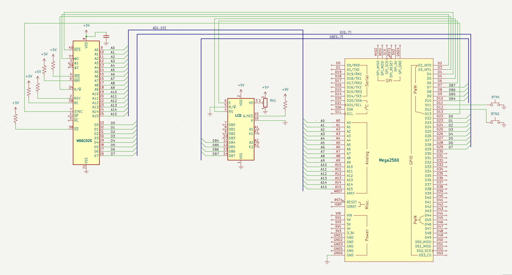
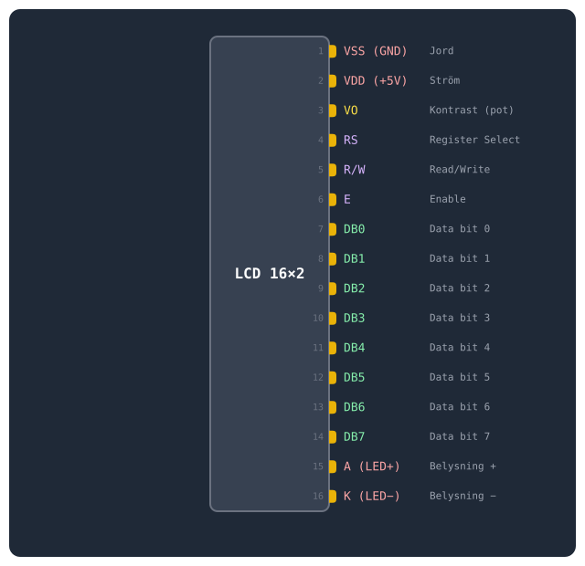

# LCD-display

Datorn fungerar — men den pratar bara med en laptop. Det här är steget där bygget börjar kännas som en riktig maskin: tecken visas på en egen skärm.

## Mål

Datorn fungerar — men all feedback går via seriemonitorn på en laptopen. Nu kopplar jag in en LCD-display (16×2 tecken) som visar vad CPU:n gör direkt på kopplingsdäcket. Ingen datorskärm behövs egentligen längre.

LCD:n kopplas i *4-bitars parallellt läge* till Arduino. Det innebär att jag skickar data 4 bitar i taget via pinnar `D7–D10`. Arduino-biblioteket `LiquidCrystal` sköter all kommunikation — jag behöver bara tala om vilka pinnar som används.

Viktig detalj: datapinnarna är i omvänd ordning. Arduino `D10` går till LCD `DB4`, `D9` till `DB5`, `D8` till `DB6`, `D7` till `DB7`. Koden måste spegla detta:

```
LiquidCrystal lcd(
  5,  // RS
  6,  // E
  10, // DB4
  9,  // DB5
  8,  // DB6
  7   // DB7
);
```
## Nya komponenter

En 16×2 LCD-display, en 10 kΩ-potentiometer för kontrast och ett 220Ω-motstånd för bakgrundsbelysningen. 

| Antal | Komponent |
|---|---|
| 1 | 16×2 (parallell, t.ex. QC1602A) |
| 1 | 10 kΩ potentiometer (kontrast) |
| 1 | 220 Ω motstånd (bakgrundsbelysning) |

## Kopplingsschema

Schemat visar LCD-displayen ansluten i 4-bitarsläge: `RS` till `D5`, E till `D6`, och datapinnarna `DB4–DB7` till `D10`, `D9`, `D8`, `D7` i omvänd ordning. 



## LCD 16×2 — pinout

16-pin SIL (single in-line). Pin 1 är närmast kanten på de flesta moduler. Justera kontrasten med potentiometern på `VO` (pin 3).


■ Kontroll ■ Data ■ Ström ■ Kontrast. I 4-bitarsläge används endast `DB4–DB7` (pin 11–14).

## Kopplingar

Här är hela kopplingen inklusive LCD:ns 16 pinnar, markerade med egen radgrupp i tabellen. Datapinnarna `DB4–DB7` går i omvänd ordning (`D10`→`DB4`, `D9`→`DB5`…) — en klassisk fallgrop när jag kopplar, så jag dubbelkollar varje ledning mot tabellen.

| Pin | Signal | Kopplas till | Varför |
|---|---|---|---|
| 8 | `VDD` | +5V | Strömmatning — CPU:ns driftspänning |
| 21 | `VSS` | GND | Systemjord — sluten krets |
| 37 | `PHI2` | Arduino D2 | Klockingång — Arduino skickar fyrkantsvåg |
| 2 | `RDY` | +5V via 10kΩ | Ready — HÖG = CPU får köra. Utan denna stannar CPU:n |
| 4 | `/IRQ` | +5V via 10kΩ | Interrupt request — HÖG = inget avbrott |
| 6 | `/NMI` | +5V via 10kΩ | Non-maskable interrupt — måste vara HÖG |
| 36 | `BE` | +5V via 10kΩ | Bus Enable — HÖG = bussarna aktiva. Utan denna är CPU:n bortkopplad! |
| 38 | `/SO` | +5V via 10kΩ | Set Overflow — avaktiverad |
| 40 | `/RESET` | Arduino D4 | Kontrollerad reset — Arduino håller CPU:n i reset tills jag är redo |
| 9–16 | `A0–A7` | Arduino A0–A7 | Låga adressbyte — läses via PORTF |
| 17–20, 22–25 | `A8–A15` | Arduino A8–A15 | Höga adressbyte — läses via PORTK |
| 34 | `R/W` | Arduino D3 | HÖG = CPU läser, LÅG = CPU skriver. Arduino måste veta detta |
| 33 | `D0` | Arduino D22 via 100Ω | Databit 0 (LSB) |
| 32 | `D1` | Arduino D23 via 100Ω | Databit 1 |
| 31 | `D2` | Arduino D24 via 100Ω | Databit 2 |
| 30 | `D3` | Arduino D25 via 100Ω | Databit 3 |
| 29 | `D4` | Arduino D26 via 100Ω | Databit 4 |
| 28 | `D5` | Arduino D27 via 100Ω | Databit 5 |
| 27 | `D6` | Arduino D28 via 100Ω | Databit 6 |
| 26 | `D7` | Arduino D29 via 100Ω | Databit 7 (MSB) |
| 7 | `SYNC` | Arduino D13 | HÖG = CPU:n hämtar första byten av ny instruktion |
| LCD 16×2 (parallell 4-bit) |  |  |  |
| 1 | `VSS` | GND | Jord |
| 2 | `VDD` | +5V | Strömmatning |
| 3 | `VO` | Potentiometer mittben | Kontrast — sidoben till +5V och GND |
| 4 | `RS` | Arduino D5 | Register Select — 0 = kommando, 1 = data |
| 5 | `R/W` | GND | Alltid skrivläge — jag läser aldrig från LCD:n |
| 6 | `E` | Arduino D6 | Enable — Arduino pulserar för att skicka data |
| 11 | `DB4` | Arduino D10 | Data bit 4 — omvänd ordning! |
| 12 | `DB5` | Arduino D9 | Data bit 5 |
| 13 | `DB6` | Arduino D8 | Data bit 6 |
| 14 | `DB7` | Arduino D7 | Data bit 7 |
| 15 | `A` | +5V via 220Ω | Bakgrundsbelysning + |
| 16 | `K` | GND | Bakgrundsbelysning − |

## Arduino-kod

Hittills har all feedback från datorn gått via seriemonitor på en laptop. Det fungerar, men det känns inte som en riktig dator. Nu kopplar jag in en LCD-display direkt på kopplingsdäcket — och vips är datorn fristående. Ingen PC krävs för att se vad CPU:n gör.

### LCD i 4-bitarsläge — att prata med displayen

LCD-displayer med **HD44780**-kontroller (standard för 16×2 och 20×4) kan köras i två lägen: 8-bitars (alla 8 datapinnar används) eller 4-bitars (endast `DB4–DB7`). Jag använder 4-bitarsläget för att spara pinnar på Arduino. Arduino-biblioteket `LiquidCrystal` hanterar all kommunikation — jag behöver bara tala om vilka pinnar som används, och som jag såg i Mål-avsnittet speglar konstruktorn den omvända pin-ordningen.

### LCD-uppdatering inuti `pulse()`

Den stora kodändringen sitter i `pulse()`. Efter varje klockcykel uppdateras LCD:n:

- Rad 0: visar aktuell adress i formatet `A:$8000`. Padding med mellanslag håller displayen ren när adressen växlar mellan olika längder.
- Rad 1: visar data på databussen i formatet `D:$EA`. Enstaka hex-siffror paddas med en nolla för jämn bredd.

`setup()` initierar LCD:n med `lcd.begin(16, 2)` och skriver en välkomsttext. `loop()` är oförändrad från steg 4 — knapparna fungerar precis som tidigare, men nu ser jag resultatet både i seriemonitor och på displayen.

### Vad som är nytt jämfört med steg 4

I koden: `#include <LiquidCrystal.h>`, LCD-objektet, och `lcd.print()`-anropen i `pulse()`. Det är allt — resten är samma beprövade minnesemulator som tidigare.

???+ note "📦 Arduino-kod"

    ```cpp
    --8<-- "Mega_2560_6502/src/step1.inc"
    ```

## Exempel på körning

Direkt efter uppladdning visar både seriemonitor och LCD-displayen att allt är redo:

<div class="monlcd">
<div>
<p class="xlabel"><strong>Seriemonitor</strong></p>

```text
Steg 5 — LCD-display
```

</div>
<div>
<p class="xlabel"><strong>LCD-displayen — direkt efter uppladdning</strong></p>

<div class="lcd"><div class="lcd-badge">LCD 16×2</div><div class="lcd-screen"><div>W65C02S Steg 5</div><div> </div></div></div>

</div>
</div>

LCD-displayen

När jag trycker på Knapp 1 (klocksteg) uppdateras båda vyerna samtidigt. Seriemonitor loggar varje minnesaccess, LCD:n visar adress och data i realtid:

<div class="monlcd">
<div>
<p class="xlabel"><strong>Seriemonitor — efter 4 tryck på Knapp 1</strong></p>

```text
Steg 5 — LCD-display
R $FFFC
R $FFFD
R $8000
R $8001
```

</div>
<div>
<p class="xlabel"><strong>LCD-displayen — efter 4 tryck</strong></p>

<div class="lcd"><div class="lcd-badge">LCD 16×2</div><div class="lcd-screen"><div>A:$8001</div><div>D:$EA</div></div></div>

</div>
</div>

LCD-displayen — efter 4 tryck

Samma information på båda ställena — adress (`$8001`) och data (`$EA`, `NOP`). Skillnaden är att LCD:n visar *just nu* medan seriemonitor bygger en historik. Med Knapp 2 (instruktionssteg) ser jag flera rader i seriemonitor per tryck medan LCD:n uppdateras för varje klockcykel — ett snabbt flimmer av adresser tills `SYNC` går hög.

Datorn har blivit fristående. Jag kan koppla bort USB-kabeln (om Arduino drivs via DC-adaptern) och fortfarande stega genom programmet och se allt på LCD:n. Seriemonitor är praktisk för att logga och felsöka, men displayen på kopplingsdäcket gör datorn till en egen, komplett enhet. 

## Så här felsöker man

Här är några saker jag kontrollerar:

- Helt tom skärm? Då justerar jag kontrasten med potentiometern och testar båda ytterlägena.
- Svarta rutor på första raden? Då är LCD:n i 8-bitarsläge men får ingen data. Jag kontrollerar att `lcd.begin(16,2)` körs.
- Förvrängda tecken? Då är datapinnarna i fel ordning. Jag provar `LiquidCrystal lcd(5, 6, 7, 8, 9, 10)` om min display har rak ordning.
- Ingen bakgrundsbelysning? Då kontrollerar jag 220Ω till A (pin 15) och `GND` till K (pin 16).
