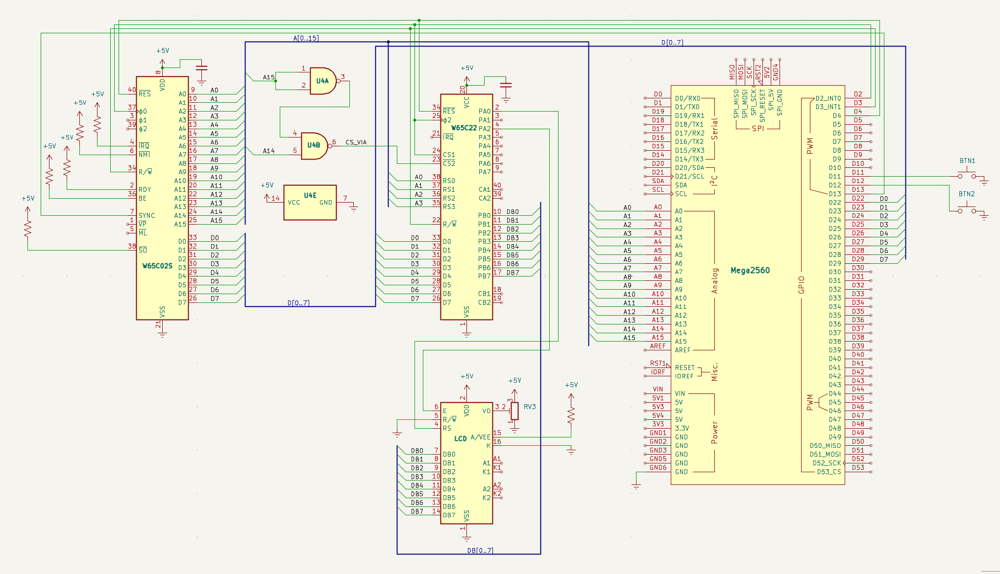
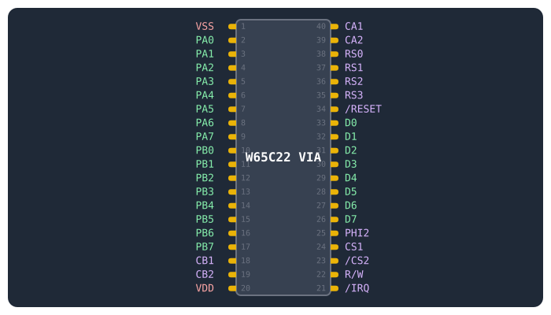

# VIA + LCD, styrd av 6502

Det här är det stora steget: från att Arduino sköter allt till att processorn själv styr LCD-displayen.

## Mål

I steg 6 styrde Arduino LCD-displayen direkt. Nu tar jag nästa stora kliv: jag kopplar in en **W65C22** VIA (Versatile Interface Adapter) — en I/O-krets som ger 6502-processorn 20 egna pinnar att styra. VIAn sitter på CPU:ns adress- och databuss, precis som ett RAM-minne, men istället för att lagra data styr den fysiska pinnar.

En **74HC00** (två NAND-grindar) avkodar adressbussen så att VIA:n hamnar på adress `$4000–$400F`. U4A inverterar `A15`, U4B NAND:ar med `A14` — resultat: VIA aktiveras när `A14`=1 och `A15`=0.

6502-programmet på `$8000` gör följande:

1. Sätter VIA:ns portar som utgångar
1. Initierar LCD:n i 8-bitarsläge (8-bitars databuss, 2 rader, 5×8 font, display on, entry mode)
1. Skriver två rader text genom att lägga ASCII-värden på port B och pulsa enable-signalen på port A — sedan *clear display* och loopa om från början

När allt fungerar har jag en dator där CPU:n själv styr I/O via minnesmappade adresser. Arduino är nu bara minnesemulator och klocka — all logik för LCD:n körs på 6502.

## Nya komponenter

De här kretsarna är starten på en riktig datorarkitektur. En **W65C22** VIA ger CPU:n 20 egna I/O-pinnar, en **74HC00** avkodar adressbussen så att VIA:n hamnar på `$4000`, och en 100 nF-kondensator håller VIA:ns strömmatning ren.

| Antal | Komponent | Not |
|---|---|---|
| 1 | W65C22 VIA (DIP-40) | 2×8-bit I/O-portar (PA0–PA7, PB0–PB7), 4 registerväljare |
| 1 | 74HC00 (quad 2-input NAND) | Adressavkodning — genererar chip select-signaler |
| 1 | LCD 16×2 (parallell, t.ex. QC1602A) | Ansluts till VIA:ns PB0–PB7 + kontrollpinnar |
| 1 | 100 nF keramisk kondensator | Avkoppling vid VIA:ns VCC/GND |

## Vad är nytt i det här steget?

- VIAn — en **W65C22** som ger processorn 20 egna I/O-pinnar, på samma buss som minnet.
- Minnesmappad I/O — att skriva till en adress (`$4000`) är samma sak som att styra pinnar.
- Adressavkodning — **74HC00**:ns grindar väljer ut VIAn:s fönster (`$4000`–`$7FFF`).
- LCD direkt från 6502 — processorn styr displayen själv; Arduino är bara minne + klocka.
- Ett mycket längre program — LCD-initieringen kräver en hel kommandosekvens, så programmet är tiotals gånger större än i steg 6.

## Så här fungerar en VIA

En VIA är som ett litet arkiv av brevlådor för elektriska signaler. Processorn skriver och läser på 16 registeradresser (`$4000`–`$400F`), och kretsen översätter varje värde till verkliga spänningar på sina pinnar. Tre saker räcker för att förstå allt jag gör här:

- Register = brevlådor. `$4000` (PORTB) och `$4001` (PORTA) är portarna — det värde processorn skriver dit läggs ut på pinnarna. `$4002`/`$4003` (DDRB/DDRA) bestämmer riktningen: 1 = utgång, 0 = ingång. Jag sätter `$FF` = alla 8 pinnar som utgångar.
- Minnesmappad I/O. VIAn har inga egna adressbegrepp — den tittar bara på sina chip-select-pinnar (`CS1` = HÖG, `/CS2` = LÅG). När 74HC00:an gör `/CS2` låg vid `$4000`–`$7FFF` svarar VIAn på alla adresser i fönstret, som om den vore 16 bytes minne (registren speglas).
- Skriv = styr, läs = avläs. När processorn skriver till PORTB läggs värdet ut på LCD:ns datapinnar. När den läser PORTB avläses pinnarnas spänningar.

LCD:ns *fallande flank* är den sista pusselbiten: displayen läser databussen i ögonblicket då `E` (PA2) går från HÖG till LÅG. Därför skriver varje tecken- eller kommandosekvens alltid i tre steg: data till PORTB → `E`=1 → `E`=0.

## Kopplingsschema

Schemat visar hur fyra kretsar nu delar på adress- och databussen: CPU, Arduino, VIA och **74HC00**. VIAn får sin klocka, `R/W` och reset från CPU:n, medan **74HC00**:ns utsignal till `/CS2` avgör när VIAn får prata. LCD:n har flyttat från Arduino till VIA:ns portar.



## W65C22 VIA — pinout

DIP-40-kapsel. Två 8-bitars I/O-portar (PA, PB), 4 kontrollpinnar (`CA1–CB2`), bussanslutning. Samma kapsel som CPU:n — var noga med orienteringen.


## 74HC00 — pinout

DIP-14-kapsel. Fyra 2-ingångars NAND-grindar. U4A+U4B används för VIA-avkodning, U4C+U4D är lediga (används för SRAM i steg 9).


## Kopplingar — krets för krets

Kopplingarna är organiserade krets för krets, eftersom adress- och databussen nu delas av fyra enheter. För varje krets finns en egen tabell: vad varje pinne heter, vart den går, och varför. Börja med CPU:n, följ sedan VIA:n och 74HC00:ns avkodning, och avsluta med LCD:n.

### W65C02S CPU

Här är alla kopplingar för CPU:n. Den får klocka, `R/W` och reset från Arduino, och delar adress- och databussen med VIA:n och 74HC00:an. Avkopplingskondensatorn är markerad längst ner.

??? note "📦 Kopplingar — CPU, klocka, ström, adressbuss, reset och databuss"

    | Pin | Signal | Kopplas till | Varför |
    |---|---|---|---|
    | 8 | `VDD` | +5V | Strömmatning |
    | 21 | `VSS` | GND | Systemjord |
    | 37 | `PHI2` | Arduino D2 | Klocka — Arduino genererar 500 Hz fyrkantsvåg |
    | 34 | `R/W` | Arduino D3 + VIA pin 22 | Talar om för alla kretsar om CPU:n läser eller skriver |
    | 40 | `/RESET` | Arduino D4 + VIA pin 34 | Kontrollerad reset — båda kretsarna startar samtidigt |
    | 9–16, 17–20, 22–25 | `A0–A15` | Arduino A0–A15 + VIA + 74HC00 | Adressbuss — alla kretsar delar samma 16 linjer |
    | 26–33 | `D0–D7` | Arduino D22–D29 + VIA D0–D7 | Databuss — 100Ω seriemotstånd på varje ledning |
    | 2 | `RDY` | +5V via 10kΩ | Ready — HÖG = CPU kör, LÅG = paus |
    | 4 | `/IRQ` | +5V via 10kΩ | Interrupt — avaktiverad (HÖG = inget avbrott) |
    | 6 | `/NMI` | +5V via 10kΩ | Non-maskable interrupt — avaktiverad |
    | 36 | `BE` | +5V via 10kΩ | Bus Enable — HÖG = bussarna aktiva. Utan denna är CPU:n bortkopplad! |
    | 38 | `/SO` | +5V via 10kΩ | Set Overflow — avaktiverad |

### W65C22 VIA

Här är alla kopplingar för VIAn. Den får klocka, `R/W` och reset från CPU:n, och styr LCD:n via port A/B. Avkopplingskondensatorn är markerad längst ner.

??? note "📦 Kopplingar — W65C22 VIA"

    | Pin | Signal | Kopplas till | Varför |
    |---|---|---|---|
    | 20 | `VDD` | +5V | Strömmatning — glöm inte avkoppling 100nF till GND |
    | 1 | `VSS` | GND | Systemjord |
    | 25 | `PHI2` | CPU PHI2 (pin 37) | Samma klocka som CPU — VIAn synkroniseras med bussen |
    | 22 | `R/W` | CPU R/W (pin 34) | VIAn behöver veta om CPU:n läser eller skriver |
    | 34 | `/RESET` | CPU /RESET (pin 40) | VIAns interna register nollställs vid reset |
    | 26–33 | `D0–D7` | CPU D0–D7 | Databuss — VIAn läser/skriver data här |
    | 38–35 | `RS0–RS3` | CPU A0–A3 | Registerväljare — vilket av VIAns 16 register som adresseras |
    | 24 | `CS1` | +5V | Chip Select 1 — aktiv HÖG. Permanent aktiverad |
    | 23 | `/CS2` | 74HC00 pin 6 (utgång) | Chip Select 2 — aktiv LÅG. 74HC00 drar denna LÅG när A15=0, A14=1 |
    | 2 | `PA0` | LCD RS (pin 4) | Register Select: LÅG = kommando, HÖG = data |
    | 4 | `PA2` | LCD E (pin 6) | Enable — fallande flank får LCD:n att läsa databussen |
    | 10–17 | `PB0–PB7` | LCD DB0–DB7 | 8-bitars parallell data till LCD:n |

### 74HC00 (adressavkodning)

Här är kopplingarna för U4A + U4B i **74HC00**:an. De avgör när VIAn ska svara på CPU:ns läs- och skrivförfrågningar.

??? note "📦 Kopplingar — 74HC00 (adressavkodning för VIA)"

    | Pin | Signal | Kopplas till | Varför |
    |---|---|---|---|
    | 1, 2 | `A15` (in) | CPU `A15` | Båda ingångarna till A15 → ut = NOT A15 (inverterare) |
    | 3 | NOT `A15` (ut) | U4B pin 4 | NOT A15 → grind B ingång 1 |
    | 4 | NOT `A15` | U4A pin 3 | NOT A15 |
    | 5 | `A14` (in) | CPU `A14` | (NOT A15) NAND A14 → LÅG när A15=0, A14=1 |
    | 6 | VIA `/CS2` (ut) | VIA `/CS2` (pin 23) | LÅG vid $4000–$7FFF → VIA aktiverad |
    | 14 | `VCC` | +5V | Strömmatning |
    | 7 | `GND` | GND | Systemjord |

### LCD 16×2 (parallell)

Här är kopplingarna för LCD:n, som nu styrs av VIAn istället för Arduino. Datapinnarna `DB0–DB7` går till VIA:ns port B, och kontrollpinnarna `RS` och `E` går till port A. Jag läser aldrig från LCD:n, så `R/W` är alltid LÅG.

??? note "📦 Kopplingar — LCD 16×2"

    | Pin | Signal | Kopplas till | Varför |
    |---|---|---|---|
    | 1 | `VSS` | GND | Jord |
    | 2 | `VDD` | +5V | Strömmatning |
    | 3 | `VO` | Potentiometer (10kΩ) | Kontrast — mittbenet till VO, sidoben till +5V och GND |
    | 4 | `RS` | VIA PA0 (pin 2) | Register Select — 0 = instruktion, 1 = teckendata |
    | 5 | `R/W` | GND | Alltid skrivläge — jag läser aldrig från LCD:n |
    | 6 | `E` | VIA PA2 (pin 4) | Enable — VIAn pulserar denna för att skicka data |
    | 7–14 | `DB0–DB7` | VIA PB0–PB7 | 8-bitars data — teckenkod eller kommando |
    | 15 | `A` | +5V via 220Ω | Bakgrundsbelysning anod (+) |
    | 16 | `K` | GND | Bakgrundsbelysning katod (−) |

## Minneskarta

**6502**-processorn har 16 adresslinjer = 64 KB adressrymd. Arduinon svarar på adresser där den har data, och tri-statar vid **VIA**-adresser så den fysiska kretsen kan svara.

<div class="memmap">

      <div style="min-height:8px;display:flex;align-items:stretch;border-bottom:1px solid #e5e7eb">
        <div style="min-height:8px;width:5rem;padding-right:.75rem;display:flex;flex-direction:column;justify-content:space-between;text-align:right">
          <span style="color:#6b7280">$FFFF</span>
          <span style="color:#6b7280">$FFFA</small>
        </div>
        <div style="min-height:8px;flex:1 1 0%;background-color:#f3e8ff;border-left:1px solid #c4b5fd;border-right:1px solid #c4b5fd;padding-left:.5rem;padding-right:.5rem;display:flex;align-items:center">vectors[6] — NMI, RESET, IRQ</div>
        <div style="width:3.5rem;text-align:right;color:#6b7280;padding-right:.5rem">6 B</div>
      </div>
      <div style="height:200px;display:flex;align-items:stretch;border-bottom:1px solid #e5e7eb">
        <div style="width:5rem;text-align:right;padding-right:.75rem;color:#9ca3af;align-self:flex-start;padding-top:.25rem">$FFF9</div>
        <div style="flex:1 1 0%;background-color:#f3f4f6;padding-left:.5rem;padding-right:.5rem;display:flex;align-items:center;color:#9ca3af">oanvänt (returnerar $EA = NOP)</div>
        <div style="width:3.5rem;text-align:right;color:#9ca3af;padding-right:.5rem;align-self:flex-start;padding-top:.25rem">~30 KB</div>
      </div>
      <div style="min-height:16px;display:flex;align-items:stretch;border-bottom:1px solid #e5e7eb">
        <div style="min-height:16px;width:5rem;padding-right:.75rem;display:flex;flex-direction:column;justify-content:space-between;text-align:right">
          <span style="color:#6b7280">$8800</span>
          <span style="color:#6b7280">$8000</span>
        </div>
        <div style="flex:1 1 0%;background-color:#dbeafe;border-left:1px solid #93c5fd;border-right:1px solid #93c5fd;padding-left:.5rem;padding-right:.5rem;display:flex;align-items:center">program[2048] — 6502-program</div>
        <div style="width:3.5rem;text-align:right;color:#6b7280;padding-right:.5rem">2 KB</div>
      </div>
      <div style="height:100px;display:flex;align-items:stretch;border-bottom:1px solid #e5e7eb">
        <div style="width:5rem;text-align:right;padding-right:.75rem;color:#9ca3af;align-self:flex-start;padding-top:.25rem">$7FFF</div>
        <div style="flex:1 1 0%;background-color:#f3f4f6;padding-left:.5rem;padding-right:.5rem;display:flex;align-items:center;color:#9ca3af">oanvänt</div>
        <div style="width:3.5rem;text-align:right;color:#9ca3af;padding-right:.5rem;align-self:flex-start;padding-top:.25rem">~16 KB</div>
      </div>
      <div style="min-height:8px;display:flex;align-items:stretch;border-bottom:2px solid #d1d5db;border-bottom:2px solid #eab308">
        <div style="min-height:8px;width:5rem;padding-right:.75rem;display:flex;flex-direction:column;justify-content:space-between;text-align:right">
          <span style="color:#6b7280">$4010</span>
          <span style="color:#6b7280">$4000</span>
        </div>
        <div style="min-height:8px;flex:1 1 0%;background-color:#fef9c3;border-left:1px solid #facc15;border-right:1px solid #facc15;padding-left:.5rem;padding-right:.5rem;display:flex;align-items:center;font-weight:700">W65C22 VIA (fysisk krets)</div>
        <div style="width:3.5rem;text-align:right;color:#6b7280;padding-right:.5rem">16 B</div>
      </div>
      <div style="height:100px;display:flex;align-items:stretch;border-bottom:1px solid #e5e7eb">
        <div style="width:5rem;text-align:right;padding-right:.75rem;color:#9ca3af;align-self:flex-start;padding-top:.25rem">$3FFF</div>
        <div style="flex:1 1 0%;background-color:#f3f4f6;padding-left:.5rem;padding-right:.5rem;display:flex;align-items:center;color:#9ca3af">oanvänt</div>
        <div style="width:3.5rem;text-align:right;color:#9ca3af;padding-right:.5rem;align-self:flex-start;padding-top:.25rem">~15 KB</div>
      </div>
      <div style="min-height:8px;display:flex;align-items:stretch;border-bottom:1px solid #e5e7eb">
        <div style="min-height:8px;width:5rem;padding-right:.75rem;display:flex;flex-direction:column;justify-content:space-between;text-align:right">
          <span style="color:#6b7280">$0400</span>
          <span style="color:#6b7280">$0200</span>
        </div>
        <div style="min-height:8px;flex:1 1 0%;background-color:#dcfce7;padding-left:.5rem;padding-right:.5rem;display:flex;align-items:center">ram[1024] — ledigt RAM</div>
        <div style="width:3.5rem;text-align:right;color:#6b7280;padding-right:.5rem">512 B</div>
      </div>
      <div style="min-height:8px;display:flex;align-items:stretch;border-bottom:1px solid #e5e7eb">
        <div style="min-height:8px;width:5rem;padding-right:.75rem;display:flex;flex-direction:column;justify-content:space-between;text-align:right">
          <span style="color:#6b7280">$0200</span>
          <span style="color:#6b7280">$0100</span>
        </div>
        <div style="min-height:8px;flex:1 1 0%;padding-left:.5rem;padding-right:.5rem;display:flex;align-items:center">Stack (JSR/RTS, PHA/PLA)</div>
        <div style="width:3.5rem;text-align:right;color:#6b7280;padding-right:.5rem">256 B</div>
      </div>
      <div style="min-height:8px;display:flex;align-items:stretch">
        <div style="min-height:8px;width:5rem;padding-right:.75rem;display:flex;flex-direction:column;justify-content:space-between;text-align:right">
          <span style="color:#6b7280">$0100</span>
          <span style="color:#6b7280">$0000</span>
        </div>
        <div style="min-height:8px;flex:1 1 0%;padding-left:.5rem;padding-right:.5rem;display:flex;align-items:center">Zero page (snabbast)</div>
        <div style="width:3.5rem;text-align:right;color:#6b7280;padding-right:.5rem">256 B</div>
      </div>
    
</div>

## 6502-program — två rader via VIA

Programmet ligger på `$8000`:

1. sätter VIA-portar som utgångar,
1. initierar LCD i 8-bitarsläge,
1. skriver två rader text,
1. clear display och loopa om och loopa om. För varje byte: lägg data på PORTB, pulsa E (`PA2`) på `PORTA`.

### VIAns register (adress `$4000`–`$4003`)
| Adress | Register | Funktion |
|---|---|---|
| $4000 | ORB (PORTB) | LCD data (DB0–DB7) |
| $4001 | ORA (PORTA) | LCD kontroll (PA0=RS, PA2=E) |
| $4002 | DDRB | Data Direction B ($FF = alla utgångar) |
| $4003 | DDRA | Data Direction A |

### Att skriva ett tecken till LCD

1. Sätt data: `STA $4000` — skicka ASCII-tecknet till PORTB (LCD `DB0–DB7`)
1. Sätt `RS`=1, E=1: `LDA #$05; STA $4001` — `PA0`=`RS`=1 (data), `PA2`=E=1
1. Sätt E=0: `LDA #$01; STA $4001` — `PA2`=E=0 (fallande flank → LCD läser)

### Programmet i maskinkod

Tabellen nedan visar hur Arduino bygger 6502-programmet i minnet, byte för byte. Första delen initierar VIA-portarna och LCD-displayen (8-bitarsläge, 2 rader, 5×8 font). Därefter skrivs en textrad i taget: cursor-positionering (→ rad 1), `RS`=1 (teckenläge), och så varje ASCII-tecken med en enable-puls. Efter sista tecknet kommer clear display och ett `JMP`-hopp tillbaka till början.

??? note "6502-programmet i maskinkod"

    | Steg | Assembler | Bytes | Förklaring |
    |---|---|---|---|
    | VIA-init — sätt portar som utgångar |  |  |  |
    | 1 | LDA #$FF | A9 FF | Alla pinnar = utgång |
    | 2 | STA $4002 | 8D 02 40 | DDRB = $FF (LCD data) |
    | 3 | STA $4003 | 8D 03 40 | DDRA = $FF (RS + E) |
    | LCD-init — tvinga 8-bitarsläge ($30 × 3) |  |  |  |
    | 4–6 | LDA #$30 STA $4000 LDA #$04 · STA $4001 LDA #$00 · STA $4001 | A9 30 8D 00 40 A9 04 8D 01 40 A9 00 8D 01 40 | $30 till PORTB, pulsa E (RS=0). Upprepas 3 gånger för att garantera 8-bit |
    | Function Set: 8-bit, 2 rader, 5×8 font |  |  |  |
    | 7 | LDA #$38 STA $4000 LDA #$04 · STA $4001 LDA #$00 · STA $4001 | A9 38 8D 00 40 A9 04 8D 01 40 A9 00 8D 01 40 | $38 = 8-bit, 2 rader, 5×8 — pulsa E |
    | Display ON/OFF: display on, cursor off, blink off |  |  |  |
    | 8 | LDA #$0C STA $4000 LDA #$04 · STA $4001 LDA #$00 · STA $4001 | A9 0C 8D 00 40 A9 04 8D 01 40 A9 00 8D 01 40 | Display ON, cursor OFF |
    | Clear display + Entry mode: increment, no shift |  |  |  |
    | 9 | LDA #$01 STA $4000 LDA #$04 · STA $4001 LDA #$00 · STA $4001 | A9 01 8D 00 40 A9 04 8D 01 40 A9 00 8D 01 40 | Clear display |
    | 10 | LDA #$06 STA $4000 LDA #$04 · STA $4001 LDA #$00 · STA $4001 | A9 06 8D 00 40 A9 04 8D 01 40 A9 00 8D 01 40 | Entry mode: increment, no shift |
    | Rad 1: "=== 6502 VIA LCD ===" (cursor till $00) |  |  |  |
    | 11 | LDA #$80 · STA $4000 LDA #$04 · STA $4001 LDA #$00 · STA $4001 | A9 80 8D 00 40 … | Kommando $80 = sätt DDRAM-adress 0 (rad 1, pos 0) |
    | 12 | LDA #$01 · STA $4001 | A9 01 8D 01 40 | RS=1 (data-läge) |
    | 13 | För varje tecken: LDA #tecken · STA $4000 LDA #$05 · STA $4001 LDA #$01 · STA $4001 | A9 xx 8D 00 40 A9 05 8D 01 40 A9 01 8D 01 40 | Data + RS=1,E=1 → RS=1,E=0 (fallande flank). 19 tecken |
    | Rad 2: "W65C02" (cursor $C0) |  |  |  |
    | 14 | LDA #$C0 … | Cursor till rad 2 → "W65C02" |  |
    | Clear + loop |  |  |  |
    | 17 | LDA #$01 · STA $4000 LDA #$04 · STA $4001 LDA #$00 · STA $4001 | A9 01 8D 00 40 … | Clear display |
    | 18 | JMP hello_start | 4C xx xx | Hoppa tillbaka till rad 1 — oändlig loop |

### `is_via()` — Arduinons sätt att kliva ur vägen

Den viktigaste nya funktionen är `is_via()`. Den returnerar `true` för adresser mellan `$4000` och `$400F` — de 16 bytes som W65C22 VIA-kretsen ockuperar. När CPU:n läser eller skriver till dessa adresser måste Arduino *tri-stata* databussen (`DDRA = 0x00`) så att den fysiska VIA-kretsen kan svara. Om Arduino skulle driva bussen samtidigt som VIA:n blir det en busskollision — dyrbar rök.

Samma logik gäller i `write_mem()`: om adressen är en VIA-adress gör Arduino ingenting. VIAn tar emot skrivningen direkt från CPU:n via den delade databussen. Arduino är en passiv åskådare för just dessa 16 adresser.

### `read_mem()` och `write_mem()` — nu med full adressrymd

Minneshanteringen har vuxit. `program[2048]` täcker `$8000–$87FF` — 2 KB programkod. `ram[1024]` täcker zero page, stack och ledigt RAM (`$0000–$03FF`). `vectors[6]` täcker `$FFFA–$FFFF`. Allt annat returnerar `$EA` (`NOP`). Ordningen i `read_mem()` är viktig: VIA-adresser kontrolleras först, eftersom de inte får hanteras av Arduino över huvud taget.

### 6502-programmet byggs i `setup()`

Programmet som CPU:n ska köra byggs byte för byte med `write_mem(next++, ...)`. `next` är en pekare som automatiskt räknas upp efter varje byte — ett enkelt trick som gör koden mycket mer läsbar än hårdkodade adresser. Programmet gör följande, i tur och ordning:

1. Sätt VIA-portar som utgångar — `LDA #$FF` → `STA $4002` (DDRB) → `STA $4003` (`DDRA`). Alla 16 pinnar på port A och B blir utgångar.
1. LCD-init i 8-bitarsläge — skickar `$30` tre gånger (väcker LCD:n i 8-bitarsläge), sedan `$38` (2 rader, 5×8 font), `$0C` (display on), `$01` (clear), `$06` (entry mode). Standardsekvens för HD44780.
1. Skriv text — sätter cursor på rad 1 (`$80`), byter till data-läge (`RS`=1), och skickar en sträng tecken för tecken via PORTB. Varje tecken kräver en enable-puls: `$05` (`RS`=1, E=1) → `$01` (`RS`=1, E=0). Den fallande flanken på E får LCD:n att läsa PORTB.
1. Clear + loop — avslutar med clear display (`$01`) och `JMP` tillbaka till textutskriften. Oändlig loop.

### Arduino-koden

Koden innehåller en `phase`-variabel och fasdetektion som känner igen var i programmet CPU:n befinner sig — reset-sekvens, VIA-init, LCD-init, textutskrift, loop. Det är ovärderligt för felsökning: jag ser direkt om CPU:n fastnar i fel fas eller hoppar till en oväntad adress.

Komplett Arduino-kod för steg 7:

??? note "📦 Arduino-kod"

    ```cpp
    --8<-- "Mega_2560_6502/src/step1.inc"
    ```

## Exempel på körning

När jag laddat upp koden och öppnar seriemonitor ser jag programmet genomlöpa alla faser. Samtidigt vaknar LCD-displayen till liv — styrd helt av 6502-processorn via VIA-kretsen:

<div class="monlcd">
<div>
<p class="xlabel"><strong>Seriemonitor</strong></p>

```text
══════ RESET-SEKVENS — CPU lämnar reset ══════
R $FFFC  ← RESET-VEKTOR LÅG
R $FFFD  ← RESET-VEKTOR HÖG

══════ PROGRAMSTART $8000 — LDA #$FF ══════
R $8000  ← OPCODE

══════ VIA INIT — Sätter portar som utgångar ══════
W $4002  ← VIA: FF  (DDRB)
W $4003  ← VIA: FF  (DDRA)

══════ LCD INIT — Skickar init-kommandon ══════
W $4000  ← VIA: 30  (×3 för 8-bit)
W $4000  ← VIA: 38  (2 rader, 5×8)
W $4000  ← VIA: 0C  (display on)
W $4000  ← VIA: 01  (clear)
W $4000  ← VIA: 06  (entry mode)

══════ HELLO UTSKRIFT — Skriver text ══════
W $4000  ← VIA: 3D  (=)
...
══════ KLAR — JMP loop ══════
```

</div>
<div>
<p class="xlabel"><strong>LCD-displayen — efter hello-utskriften</strong></p>

<div class="lcd"><div class="lcd-badge">LCD 16×2</div><div class="lcd-screen"><div>=== 6502 VIA LCD ===</div><div>Hello from W65C02!</div></div></div>

</div>
</div>

LCD-displayen — efter hello-utskriften

CPU:n har skrivit två rader text till LCD:n via VIA:ns portar. Varje tecken skickades som en `W $4000` i seriemonitor.

Varje `W $4000` eller `W $4001` är CPU:n som skriver till VIA:ns register — Arduino gör ingenting, den fysiska VIA-kretsen fångar upp skrivningen och styr LCD:n. Texten rullar fram på displayen, tecken för tecken, styrd helt av 6502-processorn.

När programmet når slutet hoppar det tillbaka till början och skriver om alltihop. Clear display, skriv text, clear display — i en oändlig loop. Datorn är nu självförsörjande: CPU:n styr I/O, Arduino levererar bara programkoden och klockan.

### Så här provar jag

- Jag ändrar rad-strängarna i `step7.inc` till mitt eget namn och laddar om — LCD:n visar min text.
- Jag mäter `/CS2` (VIA pin 23) medan jag stegar — den ska vara låg vid `$4000`–`$7FFF`.

## Så här felsöker man

Här är några saker jag kontrollerar:

1. Startar CPU:n inte? Ser jag `W $0` eller `W $1`? Då kontrollerar jag `BE` (HÖG), `PHI2` (pulser), `RESB` (HÖG efter reset).

2. Ser jag inga $4xxx-adresser? Då dubbelkollar jag 74HC00-kopplingen och att VIA:ns bussanslutningar sitter rätt.

3. Mät med multimeter:

- `PHI2` (CPU pin 37): ~2.`5V` medel (500 Hz fyrkant)
- `BE` (CPU pin 36): >4.8V
- VIA `/CS2` (pin 23): ska gå LÅG vid `$4000`–`$7FFF`
- VIA `VDD` (pin 20): >4.8V
- 74HC00 VCC (pin 14): >4.8V

4. Arduino som logikanalysator: jag kopplar `D8` till en mätpunkt och lägger till i `pulse()`:

```
Serial.print(" D8="); Serial.print(digitalRead(8));
```

5. Vanliga missar:

- `CS1` (VIA pin 24) flytande — måste ha +`5V`
- 74HC00 VCC/GND glömt
- Arduino driver databussen vid VIA-adresser — koden måste sätta `DDRA`=`0x00`
- Spänningsfall — mät `VDD` vid CPU, VIA och 74HC00 (alla >4.8V)
